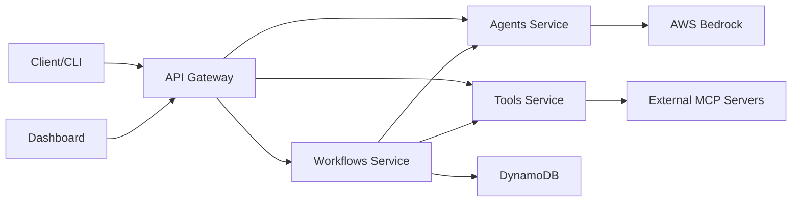

# Bedrock Agent System

A microservices-based monorepo for AI-powered code transformation and analysis, featuring Model Context Protocol (MCP) support, a modern dashboard, and CLI tools.

## Architecture Overview

The Bedrock Agent System follows a distributed microservices architecture:

- **MCP Server**: Core NestJS backend with LangGraph workflow orchestration
- **Dashboard**: Next.js web application for monitoring and management
- **CLI Tools**: Command-line interface for direct MCP interactions
- **Microservices**: Separated services for agents, tools, workflows, and API gateway

## Repository Structure

```
.
├── apps/                              # Application packages
│   ├── mcp-hybrid-server/            # Core MCP server (NestJS + LangGraph)
│   │   ├── src/
│   │   │   ├── agents/               # AI agent implementations
│   │   │   ├── tools/                # MCP tool registry
│   │   │   ├── workflows/            # LangGraph workflows
│   │   │   └── integrations/         # External service integrations
│   │   └── docker/
│   │       ├── gateway/              # API Gateway service
│   │       ├── agents/               # Agents microservice
│   │       ├── tools/                # Tools microservice
│   │       └── workflows/            # Workflows microservice
│   └── mcp-dashboard/                # Web dashboard (Next.js)
│       ├── src/
│       │   ├── components/           # React components
│       │   ├── app/                  # Next.js app router
│       │   └── store/                # State management
│       └── public/
├── packages/                          # Shared packages
│   ├── eslint-config/                # Shared ESLint configurations
│   ├── typescript-config/            # Shared TypeScript configurations
│   └── prettier-config/              # Shared Prettier configurations
├── infrastructure/                    # Infrastructure packages
│   └── mcp-hybrid-stack/             # AWS CDK infrastructure
│       ├── lib/
│       │   ├── microservices-stack.ts # Fargate services definition
│       │   └── monitoring-stack.ts    # CloudWatch and observability
│       └── constructs/
└── deployment/                        # Deployment scripts
    ├── deploy-microservices.sh       # Microservices deployment
    └── deploy.sh                     # Legacy deployment
```

## Getting Started

### Prerequisites

- Node.js 20+
- pnpm 10+
- AWS CLI configured
- Docker & Docker Compose
- AWS CDK (for infrastructure deployment)

### Installation

```bash
# Install all dependencies
pnpm install

# Setup local development environment
./setup.sh

# Setup MCP server specifically
pnpm --filter @apps/mcp-hybrid-server run setup-local-dev

# Setup dashboard
pnpm --filter @apps/mcp-dashboard run setup
```

### Development

#### Running Services Locally

```bash
# Run all services with Docker Compose
docker-compose -f apps/mcp-hybrid-server/docker/docker-compose.dev.yml up

# Or run individual services:

# MCP Server (Backend)
pnpm --filter @apps/mcp-hybrid-server dev

# Dashboard (Frontend)
pnpm --filter @apps/mcp-dashboard dev

# Run all services in development mode
pnpm dev

# Run all tests
pnpm test

# Run linting
pnpm lint

# Build all packages
pnpm build
```

#### Microservices Development

```bash
# Start individual microservices
docker-compose -f docker-compose.mcp.yml up gateway
docker-compose -f docker-compose.mcp.yml up agents
docker-compose -f docker-compose.mcp.yml up tools
docker-compose -f docker-compose.mcp.yml up workflows
```

### Infrastructure

```bash
# Synthesize CloudFormation templates
pnpm infrastructure:synth

# Deploy infrastructure
pnpm infrastructure:deploy

# Destroy infrastructure
pnpm infrastructure:destroy
```

## Workspace Commands

The monorepo uses pnpm workspaces and Turbo for efficient builds:

- `pnpm build` - Build all packages in dependency order
- `pnpm dev` - Run all packages in development mode
- `pnpm test` - Run tests across all packages
- `pnpm lint` - Lint all packages
- `pnpm format` - Format all packages
- `pnpm clean` - Clean build artifacts

## Microservices Architecture

### Service Breakdown

1. **API Gateway Service**
   - Routes requests to appropriate microservices
   - Handles authentication and rate limiting
   - Service discovery and health checks

2. **Agents Microservice**
   - Code Analyzer Agent
   - Database Analyzer Agent
   - Knowledge Builder Agent
   - Documentation Generator Agent

3. **Tools Microservice**
   - MCP tool registry and execution
   - External tool integration
   - Tool permission management

4. **Workflows Microservice**
   - LangGraph workflow orchestration
   - State persistence with DynamoDB
   - Workflow monitoring and recovery

### Service Communication



## Package-Specific Commands

### MCP Hybrid Server

```bash
# Development
pnpm --filter @apps/mcp-hybrid-server dev

# Testing
pnpm --filter @apps/mcp-hybrid-server test
pnpm --filter @apps/mcp-hybrid-server test:e2e

# Docker - Build individual services
pnpm --filter @apps/mcp-hybrid-server docker:build:gateway
pnpm --filter @apps/mcp-hybrid-server docker:build:agents
pnpm --filter @apps/mcp-hybrid-server docker:build:tools
pnpm --filter @apps/mcp-hybrid-server docker:build:workflows

# Deployment
./deployment/deploy-microservices.sh dev
./deployment/deploy-microservices.sh prod
```

### Dashboard

```bash
# Development
pnpm --filter @apps/mcp-dashboard dev

# Build
pnpm --filter @apps/mcp-dashboard build

# Start production server
pnpm --filter @apps/mcp-dashboard start

# Testing
pnpm --filter @apps/mcp-dashboard test
```

### Infrastructure

```bash
# CDK commands for microservices
pnpm --filter @infra/mcp-hybrid-stack synth -- --context stack=microservices
pnpm --filter @infra/mcp-hybrid-stack deploy -- --context stack=microservices
pnpm --filter @infra/mcp-hybrid-stack diff -- --context stack=microservices

# Deploy monitoring stack
pnpm --filter @infra/mcp-hybrid-stack deploy -- --context stack=monitoring
```

## Configuration

### ESLint

Each package can extend the shared ESLint configuration:

```javascript
// eslint.config.mjs
import baseConfig from '@repo/eslint-config/nest';

export default [
  ...baseConfig,
  // Package-specific overrides
];
```

### TypeScript

Each package extends the appropriate TypeScript configuration:

```json
{
  "extends": "@packages/typescript-config/nest",
  "compilerOptions": {
    // Package-specific options
  }
}
```

### Prettier

Use the shared Prettier configuration in `.prettierrc.js`:

```javascript
module.exports = {
  ...require('@repo/prettier-config/prettier-base'),
};
```

## Deployment

### AWS Fargate Deployment

The system is deployed as containerized microservices on AWS Fargate:

```bash
# Deploy all microservices
./deployment/deploy-microservices.sh prod

# Deploy individual services
./deployment/deploy-microservices.sh prod --service gateway
./deployment/deploy-microservices.sh prod --service agents
./deployment/deploy-microservices.sh prod --service tools
./deployment/deploy-microservices.sh prod --service workflows
./deployment/deploy-microservices.sh prod --service dashboard
```

### Environment Configuration

Each service requires specific environment variables:

```bash
# API Gateway
CORS_ORIGINS=https://dashboard.example.com
SERVICE_DISCOVERY_ENDPOINT=http://localhost:8080
RATE_LIMIT_MAX=100

# Agents Service
AWS_REGION=us-east-1
BEDROCK_MODEL_ID=anthropic.claude-v2
BEDROCK_ENDPOINT=https://bedrock-runtime.us-east-1.amazonaws.com

# Tools Service
MCP_SERVER_ENDPOINT=/mcp
MCP_MAX_CONNECTIONS=100
TOOL_EXECUTION_TIMEOUT=300000

# Workflows Service
DYNAMODB_TABLE_NAME=workflow-states
LANGGRAPH_CHECKPOINT_INTERVAL=60
```

## Monitoring and Observability

### CloudWatch Integration

All services log to CloudWatch with structured logging:

```typescript
// Log format
{
  timestamp: "2024-01-20T10:30:00Z",
  level: "info",
  service: "agents",
  correlationId: "123e4567-e89b-12d3-a456-426614174000",
  message: "Agent execution completed",
  metadata: {
    agentType: "CodeAnalyzer",
    executionTime: 1250,
    success: true
  }
}
```

### Health Checks

Each service exposes health endpoints:

- `/health` - Basic health check
- `/health/ready` - Readiness probe
- `/health/live` - Liveness probe

### Metrics

Key metrics tracked:

- Request latency
- Service availability
- Tool execution success rate
- Workflow completion time
- Error rates by service

## Connecting Services

### Dashboard to MCP Server

The dashboard connects to the MCP server via WebSocket and REST APIs:

```typescript
// Dashboard configuration
const MCP_SERVER_URL = process.env.NEXT_PUBLIC_MCP_SERVER_URL || 'http://localhost:3000';
const WS_URL = process.env.NEXT_PUBLIC_WS_URL || 'ws://localhost:3000';
```

### CLI to MCP Server

The CLI can connect to both local and remote MCP servers:

```bash
# Connect to local server
mcp-cli connect --server http://localhost:3000

# Connect to production server
mcp-cli connect --server https://api.example.com --api-key YOUR_API_KEY

# Execute tools
mcp-cli exec code-analysis --file ./src/main.ts
mcp-cli exec generate-docs --project ./
```

## Troubleshooting

### Common Issues

1. **Service Discovery Failures**
   - Check AWS Cloud Map configuration
   - Verify security group rules
   - Ensure services are registered correctly

2. **Inter-service Communication**
   - Verify network policies
   - Check service mesh configuration
   - Review API Gateway routing rules

3. **Performance Issues**
   - Monitor CloudWatch metrics
   - Check service resource allocation
   - Review database query performance

### Debug Mode

Enable debug logging for troubleshooting:

```bash
# Set debug mode for all services
DEBUG=* docker-compose up

# Set debug mode for specific service
DEBUG=agents:* pnpm --filter @apps/mcp-hybrid-server dev
```

## Contributing

1. Create a feature branch
2. Make your changes
3. Run tests and linting
4. Submit a pull request

## License

MIT