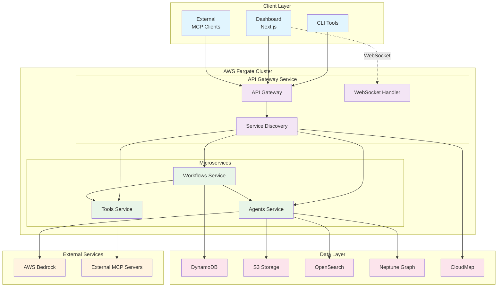
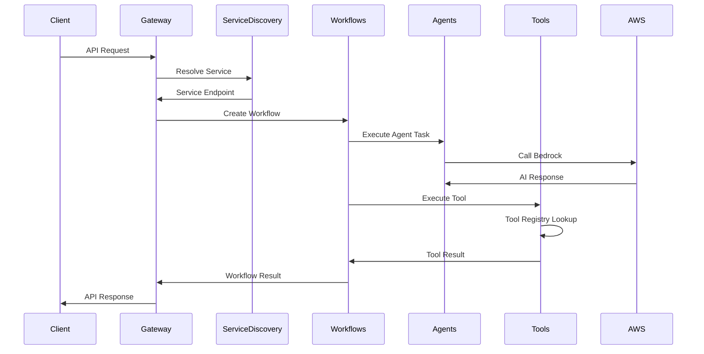
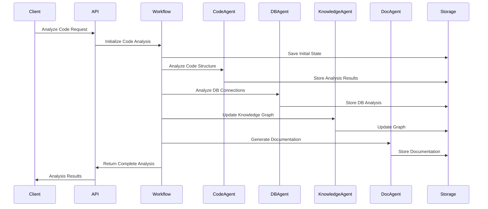
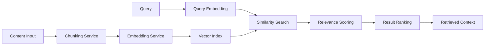
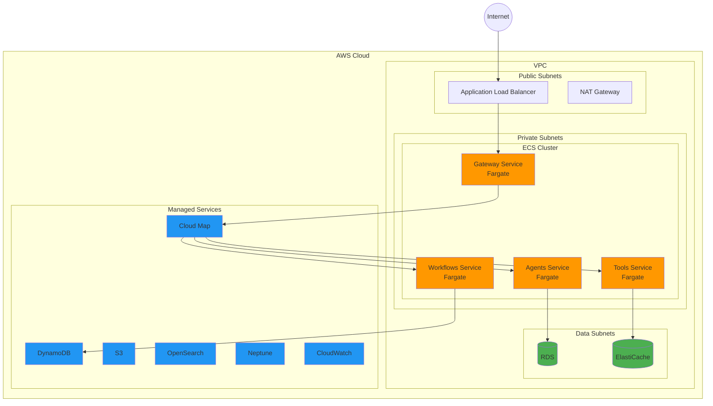
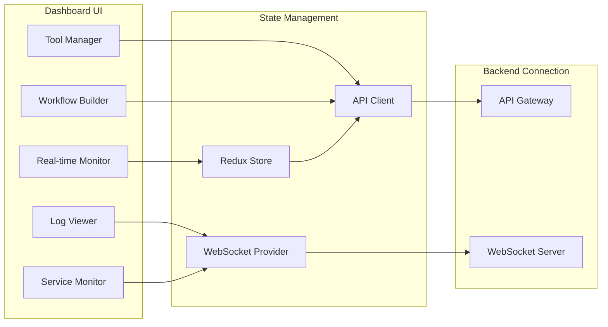

# Bedrock Agent System Architecture

## Table of Contents
- [Overview](#overview)
- [Microservices Architecture](#microservices-architecture)
- [System Architecture](#system-architecture)
- [Core Components](#core-components)
- [Service Communication](#service-communication)
- [Data Flow](#data-flow)
- [Technology Stack](#technology-stack)
- [Deployment Architecture](#deployment-architecture)
- [Security Architecture](#security-architecture)
- [Client Applications](#client-applications)

## Overview

The Bedrock Agent System is a distributed microservices platform that combines Model Context Protocol (MCP) with advanced AI capabilities. The architecture separates concerns across multiple services: API Gateway, Agents, Tools, Workflows, along with a Next.js Dashboard and CLI tools for comprehensive system interaction.

### Key Features
- **Microservices Architecture**: Distributed services deployed on AWS Fargate
- **Hybrid MCP Support**: Acts as both MCP server and client simultaneously
- **Modern Dashboard**: Next.js-based web interface for monitoring and management
- **CLI Integration**: Command-line tools for direct MCP interactions
- **AI-Powered Analysis**: Leverages AWS Bedrock for advanced code and database analysis
- **Workflow Orchestration**: Uses LangGraph for complex multi-step analysis workflows
- **Knowledge Management**: Integrates with AWS Neptune for graph-based knowledge storage
- **Vector Search**: Implements OpenSearch for semantic document retrieval
- **Stateful Workflows**: Persistent workflow state management with DynamoDB
- **Service Mesh**: Inter-service communication with service discovery

## Microservices Architecture

The system is composed of distributed microservices, each handling specific domains:

### Service Breakdown

1. **API Gateway Service**
   - Request routing and load balancing
   - Authentication and authorization
   - Rate limiting and throttling
   - Service discovery integration
   - WebSocket connection management

2. **Agents Microservice**
   - Houses all AI agent implementations
   - Manages agent lifecycle and execution
   - Integrates with AWS Bedrock
   - Handles agent-specific caching

3. **Tools Microservice**
   - MCP tool registry and management
   - Tool execution and validation
   - External tool integration
   - Permission and access control

4. **Workflows Microservice**
   - LangGraph workflow orchestration
   - State persistence with DynamoDB
   - Workflow monitoring and recovery
   - Inter-service coordination

5. **Dashboard Application**
   - Next.js web application
   - Real-time monitoring via WebSocket
   - Service health visualization
   - Tool and workflow management UI

6. **CLI Tools**
   - Direct MCP server interaction
   - Tool execution and testing
   - Workflow triggering
   - System administration

## System Architecture



## Core Components

### 1. MCP Hybrid Layer

#### MCP Server
- **Purpose**: Exposes tools to external MCP clients
- **Transport**: HTTP+SSE, WebSocket
- **Features**: Tool registry, request routing, connection management
- **Endpoint**: `/mcp`

#### MCP Client
- **Purpose**: Connects to external MCP servers
- **Transport**: STDIO, HTTP
- **Features**: Auto-discovery, health monitoring, reconnection
- **Configuration**: `.mcp/servers.json`

```typescript
// MCP Server Configuration
{
  enabled: true,
  endpoint: '/mcp',
  transport: 'http+sse',
  maxConnections: 100,
  tools: {
    maxExecutionTime: 300000,
    enableChaining: true,
    enableCaching: true
  }
}
```

### 2. Workflow Engine (LangGraph)

#### State Management
- **Persistent State**: DynamoDB-backed workflow state
- **Checkpoints**: Automatic state checkpointing
- **Recovery**: Workflow resumption from any checkpoint

#### Workflow Types
- **Code Analysis**: Multi-step code examination workflow
- **Database Analysis**: Schema and relationship analysis
- **Documentation Generation**: Automated documentation creation
- **Knowledge Building**: Graph-based knowledge construction

```typescript
// Workflow State Structure
interface CodeAnalysisState {
  workflowId: string;
  analysisStage: string;
  filePath: string;
  codeAnalysisResult?: any;
  databaseAnalysisResult?: any;
  knowledgeGraphUpdates?: any;
  documentation?: any;
  error?: string;
  toolResults: Record<string, any>;
}
```

### 3. Agent System

#### Base Agent Architecture
All agents extend the `BaseAgent` class providing:
- Consistent execution patterns
- Error handling and logging
- Bedrock integration
- Context management

#### Specialized Agents

##### Code Analyzer Agent
- **Purpose**: Static code analysis, complexity metrics, pattern detection
- **Temperature**: 0.1 (low for precise analysis)
- **Capabilities**: AST parsing, dependency analysis, security scanning

##### Database Analyzer Agent
- **Purpose**: Schema analysis, relationship mapping, optimization suggestions
- **Temperature**: 0.1 (low for accuracy)
- **Capabilities**: ER diagram generation, query optimization, index recommendations

##### Knowledge Builder Agent
- **Purpose**: Graph construction, entity extraction, relationship inference
- **Temperature**: 0.2 (balanced for reasoning)
- **Capabilities**: NER, relation extraction, ontology alignment

##### Documentation Generator Agent
- **Purpose**: Automated documentation creation, code commenting
- **Temperature**: 0.3 (higher for creative writing)
- **Capabilities**: API docs, README generation, inline comments

### 4. Tool Registry System

#### Dynamic Tool Registration
- **Self-Registration**: Tools register themselves on module initialization
- **Categorization**: Tools are organized by functional categories
- **Metadata**: Rich tool descriptions with parameter schemas

#### Tool Execution
- **Timeout Management**: Configurable execution timeouts
- **Retry Logic**: Automatic retry for transient failures
- **Caching**: Result caching for improved performance
- **Metrics**: Execution time and success rate tracking

```typescript
// Tool Registration Example
interface MCPTool {
  name: string;
  description: string;
  category: string;
  parameters: MCPToolParameterSchema;
  execute: (params: any, context?: any) => Promise<any>;
  timeout?: number;
  retryable?: boolean;
  cacheable?: boolean;
}
```

### 5. Memory Management System

#### Vector Storage
- **Provider**: AWS OpenSearch Serverless
- **Embeddings**: Amazon Titan Embed Text
- **Indexing**: Automated content chunking and embedding
- **Search**: Semantic similarity search with relevance scoring

#### Memory Operations
- **Storage**: Store analysis results, documentation, code snippets
- **Retrieval**: Context-aware memory retrieval for agents
- **Relevance**: Recency and relevance weighted scoring
- **Chunking**: Intelligent content segmentation

### 6. Integration Layer

#### AWS Bedrock Integration
- **Models**: Claude 3 Sonnet, Titan Embeddings
- **Configuration**: Temperature, max tokens, model selection per agent
- **Error Handling**: Retry logic, fallback strategies
- **Cost Optimization**: Request batching, caching

#### LangGraph Integration
- **Workflow Definition**: Graph-based workflow orchestration
- **State Persistence**: DynamoDB integration for workflow state
- **Node Execution**: Parallel and sequential node execution
- **Error Recovery**: Workflow checkpointing and recovery

## Service Communication

### Inter-Service Communication Patterns

1. **Synchronous Communication**
   - RESTful APIs between services
   - gRPC for high-performance needs
   - Request/response pattern

2. **Asynchronous Communication**
   - Event-driven via AWS EventBridge
   - Message queues for task distribution
   - WebSocket for real-time updates

3. **Service Discovery**
   - AWS Cloud Map for service registration
   - Dynamic endpoint resolution
   - Health-based routing

### Request Flow in Microservices



### Service Mesh Architecture

```yaml
# Service Communication Matrix
services:
  gateway:
    exposes: [HTTP, WebSocket]
    calls: [agents, tools, workflows]
    
  agents:
    exposes: [gRPC, HTTP]
    calls: [bedrock, s3, neptune]
    
  tools:
    exposes: [gRPC, HTTP]
    calls: [external-mcp]
    
  workflows:
    exposes: [gRPC, HTTP]
    calls: [agents, tools, dynamodb]
```

### Event-Driven Communication

```typescript
// Event Types
interface ServiceEvent {
  eventType: 'workflow.started' | 'agent.completed' | 'tool.executed';
  serviceId: string;
  correlationId: string;
  timestamp: Date;
  payload: any;
}

// Event Flow
EventBridge → Lambda → Service
         ↓
    CloudWatch Events
```

## Data Flow

### Code Analysis Workflow



### Memory System Data Flow



## Technology Stack

### Core Technologies
- **Runtime**: Node.js 18+
- **Framework**: NestJS 10+
- **AI Orchestration**: LangGraph
- **Language**: TypeScript
- **Package Manager**: pnpm

### AWS Services
- **Bedrock**: AI model hosting and inference
- **DynamoDB**: Workflow state and metadata storage
- **S3**: File storage and artifacts
- **OpenSearch Serverless**: Vector search and indexing
- **Neptune**: Graph database for knowledge representation
- **IAM**: Security and access control

### Development Tools
- **Build System**: Turbo (monorepo)
- **Testing**: Jest, Supertest
- **Linting**: ESLint, Prettier
- **API Documentation**: Swagger/OpenAPI
- **Containerization**: Docker

### Monitoring & Observability
- **Health Checks**: NestJS Terminus
- **Metrics**: Custom metrics collection
- **Logging**: Structured logging with Winston
- **Tracing**: Request correlation IDs

## Deployment Architecture

### AWS Fargate Microservices Deployment



### Container Architecture

Each microservice has its own optimized Docker image:

```dockerfile
# Gateway Service
FROM node:20-alpine AS gateway-base
WORKDIR /app
COPY packages/gateway ./
RUN npm ci --only=production
EXPOSE 3000
CMD ["node", "dist/main.js"]

# Agents Service  
FROM node:20-alpine AS agents-base
WORKDIR /app
COPY packages/agents ./
RUN npm ci --only=production
EXPOSE 3001
CMD ["node", "dist/main.js"]

# Tools Service
FROM node:20-alpine AS tools-base
WORKDIR /app
COPY packages/tools ./
RUN npm ci --only=production
EXPOSE 3002
CMD ["node", "dist/main.js"]

# Workflows Service
FROM node:20-alpine AS workflows-base
WORKDIR /app
COPY packages/workflows ./
RUN npm ci --only=production
EXPOSE 3003
CMD ["node", "dist/main.js"]
```

### Fargate Task Definitions

```json
{
  "family": "mcp-gateway-service",
  "networkMode": "awsvpc",
  "requiresCompatibilities": ["FARGATE"],
  "cpu": "512",
  "memory": "1024",
  "containerDefinitions": [{
    "name": "gateway",
    "image": "your-ecr-repo/gateway:latest",
    "portMappings": [{
      "containerPort": 3000,
      "protocol": "tcp"
    }],
    "environment": [
      {"name": "SERVICE_DISCOVERY_NAMESPACE", "value": "mcp.local"},
      {"name": "NODE_ENV", "value": "production"}
    ],
    "logConfiguration": {
      "logDriver": "awslogs",
      "options": {
        "awslogs-group": "/ecs/mcp-gateway",
        "awslogs-region": "us-east-1",
        "awslogs-stream-prefix": "gateway"
      }
    }
  }]
}
```

### Service Auto-Scaling

```yaml
# Auto-scaling configuration per service
services:
  gateway:
    min_tasks: 2
    max_tasks: 10
    target_cpu: 70
    target_memory: 80
    scale_in_cooldown: 60
    scale_out_cooldown: 60
    
  agents:
    min_tasks: 2
    max_tasks: 20
    target_cpu: 60
    target_memory: 70
    
  tools:
    min_tasks: 1
    max_tasks: 15
    target_cpu: 70
    target_memory: 75
    
  workflows:
    min_tasks: 2
    max_tasks: 25
    target_cpu: 65
    target_memory: 70
```

### Environment Separation

- **Development**: 
  - Local Docker Compose with all services
  - LocalStack for AWS service emulation
  - Hot reloading enabled
  
- **Staging**: 
  - AWS Fargate with reduced task counts
  - Shared RDS and ElastiCache instances
  - Full monitoring but relaxed alerting
  
- **Production**: 
  - AWS Fargate with auto-scaling
  - Multi-AZ deployment
  - Dedicated RDS clusters
  - Enhanced monitoring and alerting
  - Blue/green deployments

## Security Architecture

### Authentication & Authorization
- **API Keys**: MCP client authentication
- **IAM Roles**: AWS service access
- **CORS**: Cross-origin request security
- **Rate Limiting**: DDoS protection

### Data Security
- **Encryption in Transit**: TLS 1.2+ for all communications
- **Encryption at Rest**: AWS service native encryption
- **Data Classification**: Sensitive data identification and handling
- **Access Logging**: Comprehensive audit trails

### Network Security
- **VPC**: Private network isolation
- **Security Groups**: Firewall rules
- **NACLs**: Network-level access control
- **WAF**: Web application firewall

### Secret Management
- **AWS Systems Manager**: Parameter Store for configuration
- **Environment Variables**: Runtime configuration
- **IAM Policies**: Least privilege access
- **Rotation**: Automated secret rotation

## Client Applications

### Dashboard (Next.js)

The dashboard provides a comprehensive web interface for system management:

```typescript
// Dashboard Architecture
interface DashboardConfig {
  apiEndpoint: string;           // Gateway service URL
  wsEndpoint: string;           // WebSocket endpoint
  authProvider: 'cognito' | 'custom';
  refreshInterval: number;      // Real-time update interval
}

// Key Features
- Real-time service monitoring
- Tool execution interface  
- Workflow visualization
- Log aggregation viewer
- Performance metrics dashboard
- Service health monitoring
```

#### Dashboard Components



### CLI Tools

Command-line interface for direct system interaction:

```bash
# CLI Architecture
mcp-cli/
├── commands/
│   ├── connect.ts      # Connect to MCP server
│   ├── execute.ts      # Execute tools
│   ├── workflow.ts     # Manage workflows
│   ├── monitor.ts      # Monitor services
│   └── admin.ts        # Administrative tasks
├── lib/
│   ├── api-client.ts   # API communication
│   ├── auth.ts         # Authentication
│   └── config.ts       # Configuration management
└── bin/
    └── mcp-cli.ts      # Entry point
```

#### CLI Usage Examples

```bash
# Service connection
mcp-cli connect \
  --endpoint https://api.mcp.example.com \
  --auth-token $MCP_TOKEN

# Tool execution
mcp-cli execute code-analysis \
  --input "./src" \
  --output "./analysis-report.json" \
  --timeout 300

# Workflow management  
mcp-cli workflow create \
  --template "code-review" \
  --params '{"repository": "github.com/org/repo"}'

mcp-cli workflow status \
  --workflow-id "wf-123456"

# Service monitoring
mcp-cli monitor services \
  --format table \
  --refresh 5

# Administrative tasks
mcp-cli admin \
  --scale-service agents=5 \
  --region us-east-1
```

## Performance Considerations

### Microservices Performance

1. **Service-Level Optimization**
   - Independent scaling per service
   - Service-specific caching strategies
   - Optimized container images
   - Resource allocation based on workload

2. **Inter-Service Communication**
   - Connection pooling between services
   - Circuit breakers for fault tolerance
   - Request batching where applicable
   - gRPC for high-frequency communication

3. **Data Layer Optimization**
   - Read replicas for database queries
   - ElastiCache for session management
   - DynamoDB auto-scaling
   - S3 transfer acceleration

### Scalability Patterns

```yaml
# Scaling Strategy
scaling:
  horizontal:
    - Service auto-scaling based on metrics
    - Load balancer request routing
    - Database read replica scaling
    
  vertical:
    - Fargate task size optimization
    - RDS instance class selection
    - ElastiCache node types
    
  geographic:
    - Multi-region deployment
    - CloudFront for static assets
    - Route 53 geolocation routing
```

### Monitoring and Observability

```typescript
// Monitoring Stack
interface MonitoringConfig {
  cloudwatch: {
    dashboards: ['service-health', 'performance', 'business-metrics'];
    alarms: {
      errorRate: { threshold: 1, period: 300 };
      latency: { threshold: 1000, period: 60 };
      cpuUtilization: { threshold: 80, period: 300 };
    };
  };
  xray: {
    tracingEnabled: true;
    samplingRate: 0.1;
  };
  customMetrics: {
    toolExecutions: MetricType.Count;
    workflowDuration: MetricType.Timer;
    agentInvocations: MetricType.Count;
  };
}
```

### Performance Metrics

- **Service Metrics**:
  - Request latency (p50, p90, p99)
  - Throughput (requests/second)
  - Error rates by service
  - Container resource utilization

- **Business Metrics**:
  - Tool execution success rate
  - Workflow completion time
  - Agent response time
  - Cost per operation

- **Infrastructure Metrics**:
  - Fargate task health
  - Database connection pool usage
  - Cache hit rates
  - Network throughput