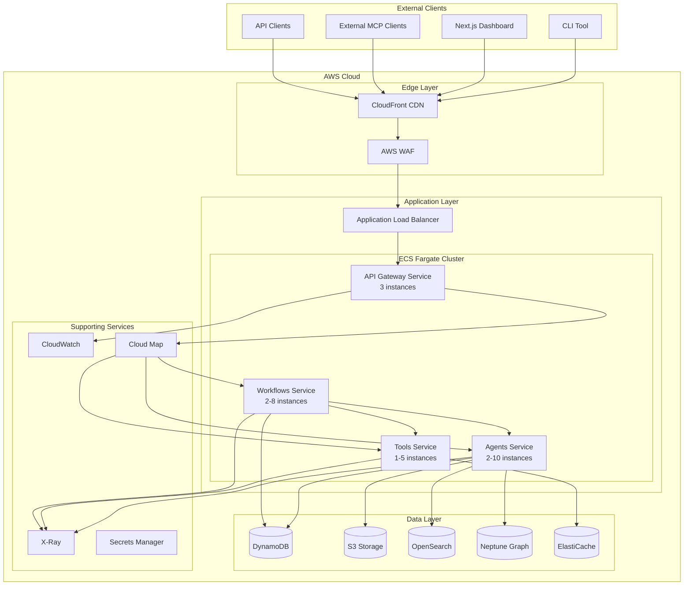
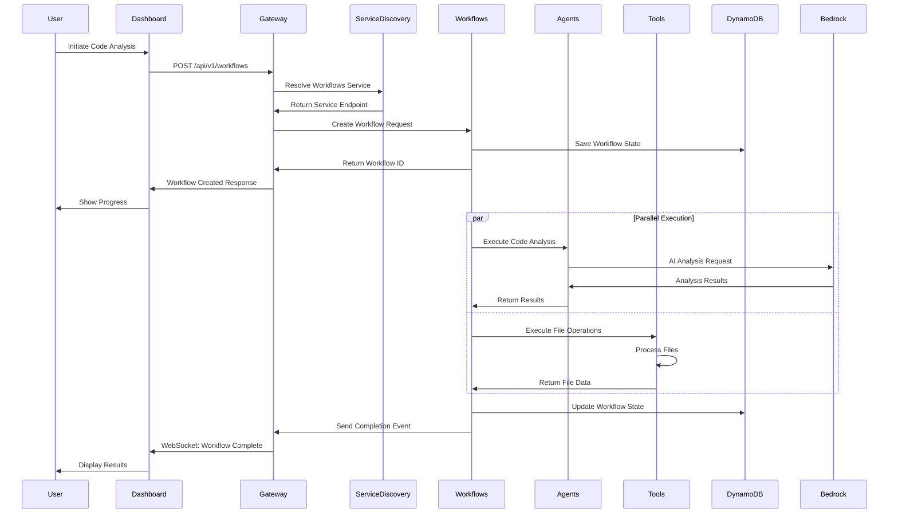

# Microservices Architecture Documentation

## Table of Contents
- [Overview](#overview)
- [Architecture Diagrams](#architecture-diagrams)
- [Service Breakdown](#service-breakdown)
- [Communication Patterns](#communication-patterns)
- [Deployment Architecture](#deployment-architecture)
- [Client Applications](#client-applications)
- [Service Discovery](#service-discovery)
- [Scaling Strategy](#scaling-strategy)

## Overview

The Bedrock Agent System follows a microservices architecture pattern, with services deployed on AWS Fargate. This architecture provides:

- **Scalability**: Each service can scale independently based on demand
- **Resilience**: Service failures are isolated and don't affect the entire system
- **Flexibility**: Services can be updated and deployed independently
- **Technology Diversity**: Services can use different tech stacks if needed

## Architecture Diagrams

### High-Level Architecture



### Service Communication Flow



## Service Breakdown

### 1. API Gateway Service

**Purpose**: Central entry point for all external requests

**Responsibilities**:
- Request routing and load balancing
- Authentication and authorization
- Rate limiting and throttling
- WebSocket connection management
- Service discovery integration
- Request/response transformation
- CORS handling

**Technology Stack**:
- NestJS Framework
- Socket.io for WebSocket
- Express middleware
- JWT authentication

**Scaling**:
- Minimum: 2 instances
- Maximum: 10 instances
- Target CPU: 70%

### 2. Agents Service

**Purpose**: Manages AI agent execution and Bedrock integration

**Agents**:
- **Code Analyzer**: Static code analysis and security scanning
- **Database Analyzer**: Schema analysis and optimization
- **Knowledge Builder**: Graph construction and entity extraction
- **Documentation Generator**: Automated documentation creation

**Technology Stack**:
- NestJS Framework
- AWS Bedrock SDK
- LangChain integration

**Scaling**:
- Minimum: 2 instances
- Maximum: 20 instances
- Target Memory: 75%

### 3. Tools Service

**Purpose**: MCP tool registry and execution engine

**Features**:
- Dynamic tool registration
- External MCP server connections
- Tool execution orchestration
- Result caching
- Permission management

**Technology Stack**:
- NestJS Framework
- MCP Protocol implementation
- Redis for caching

**Scaling**:
- Minimum: 1 instance
- Maximum: 15 instances
- Target CPU: 60%

### 4. Workflows Service

**Purpose**: LangGraph workflow orchestration

**Features**:
- Workflow state management
- Multi-step orchestration
- Checkpoint and recovery
- Event streaming
- Progress tracking

**Technology Stack**:
- NestJS Framework
- LangGraph
- DynamoDB for state

**Scaling**:
- Minimum: 2 instances
- Maximum: 25 instances
- Custom metric: Active workflows

## Communication Patterns

### Synchronous Communication

```yaml
patterns:
  request-response:
    - Gateway -> Agents: Direct HTTP calls
    - Gateway -> Tools: Direct HTTP calls
    - Gateway -> Workflows: Direct HTTP calls
    
  timeouts:
    default: 30s
    agents: 120s
    tools: 60s
    workflows: 300s
```

### Asynchronous Communication

```yaml
patterns:
  event-driven:
    - Workflows -> EventBridge -> Services
    - Services -> CloudWatch Events
    
  webhooks:
    - External services -> Gateway
    - Gateway -> Dashboard (WebSocket)
```

### Service Mesh Configuration

```yaml
app-mesh:
  virtual-services:
    - name: gateway.mcp.local
      protocol: http
      port: 3000
      
    - name: agents.mcp.local
      protocol: http
      port: 3001
      
    - name: tools.mcp.local
      protocol: http
      port: 3002
      
    - name: workflows.mcp.local
      protocol: http
      port: 3003
      
  circuit-breaker:
    threshold: 5
    interval: 30s
    timeout: 15s
```

## Deployment Architecture

### Container Images

```dockerfile
# Base image for all services
FROM node:20-alpine AS base
RUN apk add --no-cache libc6-compat
WORKDIR /app

# Service-specific builds
FROM base AS gateway
COPY --chown=node:node ./dist/gateway ./dist
EXPOSE 3000
CMD ["node", "dist/main-gateway.js"]

FROM base AS agents
COPY --chown=node:node ./dist/agents ./dist
EXPOSE 3001
CMD ["node", "dist/main-agents.js"]

FROM base AS tools
COPY --chown=node:node ./dist/tools ./dist
EXPOSE 3002
CMD ["node", "dist/main-tools.js"]

FROM base AS workflows
COPY --chown=node:node ./dist/workflows ./dist
EXPOSE 3003
CMD ["node", "dist/main-workflows.js"]
```

### Fargate Task Definitions

```json
{
  "family": "mcp-microservices",
  "networkMode": "awsvpc",
  "requiresCompatibilities": ["FARGATE"],
  "cpu": "512",
  "memory": "1024",
  "taskRoleArn": "arn:aws:iam::123456789012:role/mcp-task-role",
  "executionRoleArn": "arn:aws:iam::123456789012:role/mcp-execution-role",
  "containerDefinitions": [
    {
      "name": "service",
      "image": "123456789012.dkr.ecr.us-east-1.amazonaws.com/mcp-service:latest",
      "portMappings": [
        {
          "containerPort": 3000,
          "protocol": "tcp"
        }
      ],
      "environment": [
        {"name": "NODE_ENV", "value": "production"},
        {"name": "SERVICE_NAME", "value": "gateway"}
      ],
      "logConfiguration": {
        "logDriver": "awslogs",
        "options": {
          "awslogs-group": "/ecs/mcp-service",
          "awslogs-region": "us-east-1",
          "awslogs-stream-prefix": "service"
        }
      }
    }
  ]
}
```

## Client Applications

### Dashboard Connection

The Next.js dashboard connects to the microservices through the API Gateway:

```typescript
// Dashboard API Configuration
export const apiConfig = {
  baseURL: process.env.NEXT_PUBLIC_API_URL || 'https://api.mcp.example.com/v1',
  wsURL: process.env.NEXT_PUBLIC_WS_URL || 'wss://api.mcp.example.com/ws',
  timeout: 30000,
  headers: {
    'X-Client-Type': 'dashboard',
    'X-Client-Version': '1.0.0'
  }
};

// WebSocket Connection with Auto-reconnect
export class DashboardWebSocket {
  private ws: WebSocket | null = null;
  private reconnectAttempts = 0;
  private maxReconnectAttempts = 5;
  private reconnectDelay = 1000;

  connect() {
    this.ws = new WebSocket(apiConfig.wsURL);
    
    this.ws.onopen = () => {
      console.log('WebSocket connected');
      this.reconnectAttempts = 0;
      this.subscribe();
    };
    
    this.ws.onclose = () => {
      this.handleReconnect();
    };
    
    this.ws.onerror = (error) => {
      console.error('WebSocket error:', error);
    };
    
    this.ws.onmessage = (event) => {
      this.handleMessage(JSON.parse(event.data));
    };
  }
  
  private subscribe() {
    this.send({
      action: 'subscribe',
      types: ['workflow_update', 'service_health', 'system_metrics']
    });
  }
  
  private handleReconnect() {
    if (this.reconnectAttempts < this.maxReconnectAttempts) {
      this.reconnectAttempts++;
      setTimeout(() => this.connect(), this.reconnectDelay * this.reconnectAttempts);
    }
  }
}
```

### CLI Connection

The CLI tool connects through the API Gateway with authentication:

```typescript
// CLI API Client
export class MCPCLIClient {
  private apiKey: string;
  private baseURL: string;
  
  constructor(config: CLIConfig) {
    this.apiKey = config.apiKey || process.env.MCP_API_KEY;
    this.baseURL = config.apiUrl || 'https://api.mcp.example.com/v1';
  }
  
  async request(method: string, path: string, data?: any) {
    const response = await fetch(`${this.baseURL}${path}`, {
      method,
      headers: {
        'Authorization': `Bearer ${this.apiKey}`,
        'Content-Type': 'application/json',
        'X-Client-Type': 'cli',
        'X-Client-Version': CLI_VERSION
      },
      body: data ? JSON.stringify(data) : undefined
    });
    
    if (!response.ok) {
      throw new Error(`API error: ${response.status} ${response.statusText}`);
    }
    
    return response.json();
  }
  
  // Workflow operations
  async createWorkflow(type: string, parameters: any) {
    return this.request('POST', '/workflows', { type, parameters });
  }
  
  async getWorkflowStatus(workflowId: string) {
    return this.request('GET', `/workflows/${workflowId}`);
  }
  
  // Tool operations
  async listTools() {
    return this.request('GET', '/tools');
  }
  
  async executeTool(toolName: string, parameters: any) {
    return this.request('POST', `/tools/${toolName}/execute`, { parameters });
  }
}
```

## Service Discovery

### AWS Cloud Map Configuration

```typescript
// Service Registration
export class ServiceRegistration {
  private readonly namespace = 'mcp.local';
  
  async registerService(serviceName: string, port: number) {
    const instanceId = `${serviceName}-${process.env.HOSTNAME}`;
    
    await cloudMap.registerInstance({
      ServiceId: await this.getServiceId(serviceName),
      InstanceId: instanceId,
      Attributes: {
        AWS_INSTANCE_IPV4: await this.getPrivateIP(),
        AWS_INSTANCE_PORT: port.toString(),
        HEALTH_CHECK_PATH: '/health',
        VERSION: process.env.SERVICE_VERSION || '1.0.0'
      }
    }).promise();
  }
  
  async discoverService(serviceName: string): Promise<ServiceEndpoint[]> {
    const instances = await cloudMap.discoverInstances({
      NamespaceName: this.namespace,
      ServiceName: serviceName,
      HealthStatus: 'HEALTHY'
    }).promise();
    
    return instances.Instances.map(instance => ({
      id: instance.InstanceId,
      host: instance.Attributes.AWS_INSTANCE_IPV4,
      port: parseInt(instance.Attributes.AWS_INSTANCE_PORT),
      version: instance.Attributes.VERSION
    }));
  }
}
```

### Load Balancing Strategy

```typescript
// Round-robin load balancer with health checks
export class ServiceLoadBalancer {
  private currentIndex = 0;
  private healthyEndpoints: ServiceEndpoint[] = [];
  
  async getNextEndpoint(serviceName: string): Promise<ServiceEndpoint> {
    await this.refreshEndpoints(serviceName);
    
    if (this.healthyEndpoints.length === 0) {
      throw new Error(`No healthy endpoints for service: ${serviceName}`);
    }
    
    const endpoint = this.healthyEndpoints[this.currentIndex];
    this.currentIndex = (this.currentIndex + 1) % this.healthyEndpoints.length;
    
    return endpoint;
  }
  
  private async refreshEndpoints(serviceName: string) {
    const endpoints = await serviceDiscovery.discoverService(serviceName);
    
    // Health check all endpoints
    this.healthyEndpoints = await Promise.all(
      endpoints.map(async (endpoint) => {
        const isHealthy = await this.checkHealth(endpoint);
        return isHealthy ? endpoint : null;
      })
    ).then(results => results.filter(Boolean));
  }
  
  private async checkHealth(endpoint: ServiceEndpoint): Promise<boolean> {
    try {
      const response = await fetch(`http://${endpoint.host}:${endpoint.port}/health`, {
        timeout: 5000
      });
      return response.ok;
    } catch {
      return false;
    }
  }
}
```

## Scaling Strategy

### Auto-scaling Configuration

```yaml
services:
  gateway:
    scaling:
      min: 2
      max: 10
      metrics:
        - type: cpu
          target: 70
        - type: request_count
          target: 1000
          
  agents:
    scaling:
      min: 2
      max: 20
      metrics:
        - type: memory
          target: 75
        - type: custom
          metric: active_agent_executions
          target: 10
          
  tools:
    scaling:
      min: 1
      max: 15
      metrics:
        - type: cpu
          target: 60
        - type: request_latency
          target: 500ms
          
  workflows:
    scaling:
      min: 2
      max: 25
      metrics:
        - type: custom
          metric: active_workflows
          target: 50
        - type: queue_depth
          target: 100
```

### Scaling Policies

```typescript
// Custom scaling metrics
export class ScalingMetrics {
  async publishMetric(metricName: string, value: number, unit: string) {
    await cloudWatch.putMetricData({
      Namespace: 'MCP/Services',
      MetricData: [
        {
          MetricName: metricName,
          Value: value,
          Unit: unit,
          Dimensions: [
            {
              Name: 'ServiceName',
              Value: process.env.SERVICE_NAME
            },
            {
              Name: 'Environment',
              Value: process.env.ENVIRONMENT
            }
          ]
        }
      ]
    }).promise();
  }
  
  // Publish custom metrics for scaling
  async publishScalingMetrics() {
    // Agents service
    await this.publishMetric('ActiveAgentExecutions', 
      await this.getActiveAgentCount(), 'Count');
    
    // Tools service
    await this.publishMetric('ToolExecutionQueue', 
      await this.getQueueDepth(), 'Count');
    
    // Workflows service
    await this.publishMetric('ActiveWorkflows', 
      await this.getActiveWorkflowCount(), 'Count');
  }
}
```

## Monitoring and Observability

### Distributed Tracing

```typescript
// X-Ray integration for request tracing
import * as AWSXRay from 'aws-xray-sdk-core';

export class TracingMiddleware {
  use(req: Request, res: Response, next: NextFunction) {
    const segment = AWSXRay.getSegment();
    const subsegment = segment.addNewSubsegment(req.path);
    
    subsegment.addAnnotation('service', process.env.SERVICE_NAME);
    subsegment.addAnnotation('method', req.method);
    subsegment.addMetadata('request', {
      headers: req.headers,
      params: req.params,
      query: req.query
    });
    
    res.on('finish', () => {
      subsegment.addMetadata('response', {
        statusCode: res.statusCode,
        headers: res.getHeaders()
      });
      subsegment.close();
    });
    
    next();
  }
}
```

### Service Health Monitoring

```typescript
// Comprehensive health check implementation
export class HealthCheckService {
  async getHealth(): Promise<HealthStatus> {
    const checks = await Promise.allSettled([
      this.checkDatabase(),
      this.checkExternalServices(),
      this.checkMemoryUsage(),
      this.checkDiskSpace()
    ]);
    
    const status = checks.every(c => c.status === 'fulfilled' && c.value.healthy)
      ? 'healthy' : 'unhealthy';
    
    return {
      status,
      service: process.env.SERVICE_NAME,
      version: process.env.SERVICE_VERSION,
      uptime: process.uptime(),
      checks: checks.map((c, i) => ({
        name: ['database', 'external', 'memory', 'disk'][i],
        status: c.status === 'fulfilled' ? c.value : { healthy: false, error: c.reason }
      }))
    };
  }
}
```

This microservices architecture provides a scalable, resilient, and maintainable foundation for the Bedrock Agent System, with clear separation of concerns and independent deployment capabilities.