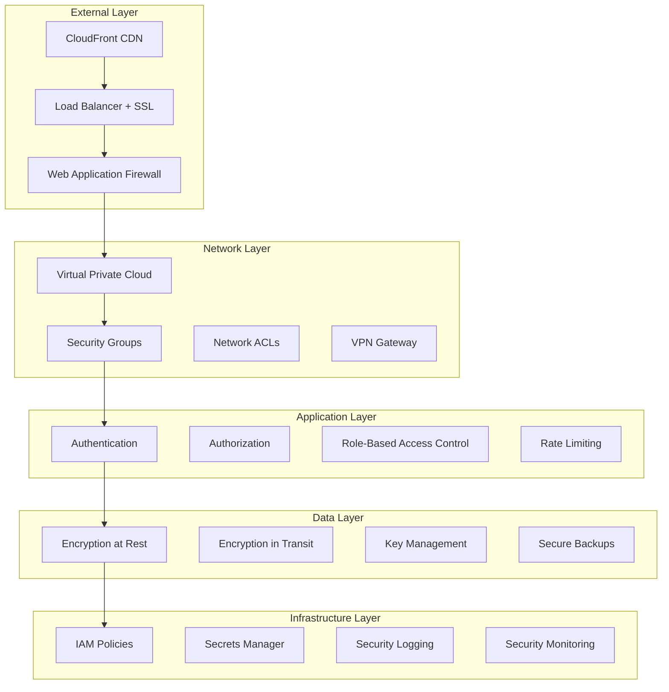

# Security Guidelines

## Table of Contents
- [Overview](#overview)
- [Security Architecture](#security-architecture)
- [Authentication & Authorization](#authentication--authorization)
- [Data Protection](#data-protection)
- [Network Security](#network-security)
- [AWS Security Best Practices](#aws-security-best-practices)
- [Application Security](#application-security)
- [MCP Protocol Security](#mcp-protocol-security)
- [Secrets Management](#secrets-management)
- [Monitoring & Incident Response](#monitoring--incident-response)
- [Security Testing](#security-testing)
- [Compliance & Auditing](#compliance--auditing)
- [Security Checklist](#security-checklist)

## Overview

The Bedrock Agent System implements comprehensive security measures to protect data, infrastructure, and communications. This guide outlines security best practices, implementation guidelines, and compliance requirements.

### Security Principles

1. **Defense in Depth**: Multiple layers of security controls
2. **Least Privilege**: Minimum necessary permissions
3. **Zero Trust**: Verify everything, trust nothing
4. **Data Classification**: Appropriate protection based on sensitivity
5. **Continuous Monitoring**: Real-time threat detection
6. **Incident Response**: Rapid response to security events

## Security Architecture

### Multi-Layer Security Model



### Security Boundaries

1. **Perimeter Security**: WAF, DDoS protection, rate limiting
2. **Network Security**: VPC isolation, security groups, NACLs
3. **Application Security**: Authentication, authorization, input validation
4. **Data Security**: Encryption, access controls, data classification
5. **Infrastructure Security**: IAM, secrets management, monitoring

## Authentication & Authorization

### API Authentication

#### API Key Authentication
```typescript
// API key validation middleware
@Injectable()
export class ApiKeyGuard implements CanActivate {
  constructor(private readonly configService: ConfigService) {}

  async canActivate(context: ExecutionContext): Promise<boolean> {
    const request = context.switchToHttp().getRequest();
    const apiKey = request.headers['x-api-key'] || request.headers['authorization']?.replace('Bearer ', '');

    if (!apiKey) {
      throw new UnauthorizedException('API key required');
    }

    // Validate API key format
    if (!this.isValidApiKeyFormat(apiKey)) {
      throw new UnauthorizedException('Invalid API key format');
    }

    // Verify API key (implement your validation logic)
    const isValid = await this.validateApiKey(apiKey);
    if (!isValid) {
      throw new UnauthorizedException('Invalid API key');
    }

    // Add user context to request
    request.user = await this.getUserFromApiKey(apiKey);
    return true;
  }

  private isValidApiKeyFormat(apiKey: string): boolean {
    // API key format: prefix_base64encodeddata
    const apiKeyRegex = /^mcp_[A-Za-z0-9+/]{32,}={0,2}$/;
    return apiKeyRegex.test(apiKey);
  }

  private async validateApiKey(apiKey: string): Promise<boolean> {
    try {
      // Hash the API key for comparison
      const hashedKey = crypto.createHash('sha256').update(apiKey).digest('hex');
      
      // Check against stored hashes (implement your storage logic)
      return await this.checkApiKeyInDatabase(hashedKey);
    } catch (error: any) {
      return false;
    }
  }
}
```

#### JWT Token Authentication
```typescript
@Injectable()
export class JwtAuthGuard extends AuthGuard('jwt') {
  canActivate(context: ExecutionContext) {
    return super.canActivate(context);
  }

  handleRequest(err: any, user: any, info: any) {
    if (err || !user) {
      throw err || new UnauthorizedException('Invalid token');
    }
    return user;
  }
}

@Injectable()
export class JwtStrategy extends PassportStrategy(Strategy) {
  constructor(configService: ConfigService) {
    super({
      jwtFromRequest: ExtractJwt.fromAuthHeaderAsBearerToken(),
      ignoreExpiration: false,
      secretOrKey: configService.get<string>('JWT_SECRET'),
      algorithms: ['HS256'],
    });
  }

  async validate(payload: any) {
    // Validate token payload
    if (!payload.sub || !payload.iat || !payload.exp) {
      throw new UnauthorizedException('Invalid token payload');
    }

    // Check if token is blacklisted
    const isBlacklisted = await this.isTokenBlacklisted(payload.jti);
    if (isBlacklisted) {
      throw new UnauthorizedException('Token has been revoked');
    }

    return {
      userId: payload.sub,
      username: payload.username,
      roles: payload.roles || [],
    };
  }
}
```

### Role-Based Access Control (RBAC)

```typescript
// Role definitions
export enum Role {
  ADMIN = 'admin',
  USER = 'user',
  DEVELOPER = 'developer',
  VIEWER = 'viewer',
}

export const ROLE_PERMISSIONS = {
  [Role.ADMIN]: ['*'],
  [Role.DEVELOPER]: [
    'workflows:create',
    'workflows:read',
    'workflows:update',
    'tools:execute',
    'agents:execute',
    'memory:read',
    'memory:write',
  ],
  [Role.USER]: [
    'workflows:read',
    'tools:execute',
    'agents:execute',
    'memory:read',
  ],
  [Role.VIEWER]: [
    'workflows:read',
    'tools:read',
    'agents:read',
    'memory:read',
  ],
};

// RBAC Guard
@Injectable()
export class RolesGuard implements CanActivate {
  constructor(private reflector: Reflector) {}

  canActivate(context: ExecutionContext): boolean {
    const requiredPermissions = this.reflector.getAllAndOverride<string[]>(
      'permissions',
      [context.getHandler(), context.getClass()],
    );

    if (!requiredPermissions) {
      return true;
    }

    const { user } = context.switchToHttp().getRequest();
    return this.hasRequiredPermissions(user, requiredPermissions);
  }

  private hasRequiredPermissions(user: any, requiredPermissions: string[]): boolean {
    const userPermissions = this.getUserPermissions(user.roles);
    
    return requiredPermissions.every(permission => 
      userPermissions.includes('*') || userPermissions.includes(permission)
    );
  }

  private getUserPermissions(roles: Role[]): string[] {
    const permissions = new Set<string>();
    
    roles.forEach(role => {
      ROLE_PERMISSIONS[role]?.forEach(permission => 
        permissions.add(permission)
      );
    });

    return Array.from(permissions);
  }
}

// Usage in controllers
@Controller('workflows')
@UseGuards(ApiKeyGuard, RolesGuard)
export class WorkflowController {
  @Post()
  @Permissions('workflows:create')
  async createWorkflow(@Body() workflowData: CreateWorkflowDto) {
    // Implementation
  }

  @Get()
  @Permissions('workflows:read')
  async listWorkflows() {
    // Implementation
  }
}
```

### MCP Authentication

```typescript
// MCP-specific authentication
@Injectable()
export class MCPAuthService {
  async authenticateClient(clientInfo: any, capabilities: any): Promise<boolean> {
    // Validate client information
    if (!clientInfo?.name || !clientInfo?.version) {
      throw new UnauthorizedException('Invalid client information');
    }

    // Check client whitelist
    const allowedClients = this.configService.get<string[]>('MCP_ALLOWED_CLIENTS', []);
    if (allowedClients.length > 0 && !allowedClients.includes(clientInfo.name)) {
      throw new UnauthorizedException(`Client '${clientInfo.name}' is not authorized`);
    }

    // Validate capabilities
    if (!this.areCapabilitiesValid(capabilities)) {
      throw new UnauthorizedException('Invalid capabilities requested');
    }

    return true;
  }

  private areCapabilitiesValid(capabilities: any): boolean {
    // Define allowed capabilities
    const allowedCapabilities = ['tools', 'resources', 'prompts'];
    
    if (!capabilities || typeof capabilities !== 'object') {
      return false;
    }

    return Object.keys(capabilities).every(cap => 
      allowedCapabilities.includes(cap)
    );
  }
}
```

## Data Protection

### Encryption at Rest

#### DynamoDB Encryption
```typescript
// DynamoDB table with encryption
const metadataTable = new dynamodb.Table(this, 'MetadataTable', {
  tableName: `MCPMetadata-${props.environment}`,
  partitionKey: { name: 'id', type: dynamodb.AttributeType.STRING },
  encryption: dynamodb.TableEncryption.CUSTOMER_MANAGED,
  encryptionKey: kmsKey,
  pointInTimeRecovery: true,
  deletionProtection: props.environment === 'production',
});
```

#### S3 Encryption
```typescript
// S3 bucket with encryption
const dataBucket = new s3.Bucket(this, 'DataBucket', {
  bucketName: `mcp-hybrid-server-data-${props.environment}`,
  encryption: s3.BucketEncryption.KMS_MANAGED,
  encryptionKey: kmsKey,
  enforceSSL: true,
  versioned: true,
  blockPublicAccess: s3.BlockPublicAccess.BLOCK_ALL,
});
```

### Encryption in Transit

#### TLS Configuration
```typescript
// Express app with TLS
import * as https from 'https';
import * as fs from 'fs';

async function bootstrap() {
  const app = await NestFactory.create(AppModule);
  
  if (process.env.NODE_ENV === 'production') {
    const httpsOptions = {
      key: fs.readFileSync(process.env.TLS_KEY_PATH),
      cert: fs.readFileSync(process.env.TLS_CERT_PATH),
      // Enforce strong TLS settings
      secureProtocol: 'TLSv1_3_method',
      ciphers: [
        'TLS_AES_128_GCM_SHA256',
        'TLS_AES_256_GCM_SHA384',
        'TLS_CHACHA20_POLY1305_SHA256',
      ].join(':'),
    };
    
    await app.listen(3000, '0.0.0.0');
  } else {
    await app.listen(3000);
  }
}
```

### Data Classification and Handling

```typescript
// Data classification service
@Injectable()
export class DataClassificationService {
  private readonly logger = new Logger(DataClassificationService.name);

  classifyData(data: any): DataClassification {
    // Implement data classification logic
    if (this.containsPII(data)) {
      return DataClassification.SENSITIVE;
    }
    
    if (this.containsBusinessData(data)) {
      return DataClassification.INTERNAL;
    }
    
    return DataClassification.PUBLIC;
  }

  async sanitizeData(data: any, classification: DataClassification): Promise<any> {
    switch (classification) {
      case DataClassification.SENSITIVE:
        return this.sanitizeSensitiveData(data);
      case DataClassification.INTERNAL:
        return this.sanitizeInternalData(data);
      default:
        return data;
    }
  }

  private containsPII(data: any): boolean {
    const piiPatterns = [
      /\b\d{3}-\d{2}-\d{4}\b/, // SSN
      /\b\d{4}[\s-]?\d{4}[\s-]?\d{4}[\s-]?\d{4}\b/, // Credit card
      /\b[A-Za-z0-9._%+-]+@[A-Za-z0-9.-]+\.[A-Z|a-z]{2,}\b/, // Email
    ];

    const dataString = JSON.stringify(data);
    return piiPatterns.some(pattern => pattern.test(dataString));
  }

  private async sanitizeSensitiveData(data: any): Promise<any> {
    // Implement PII redaction
    const dataString = JSON.stringify(data);
    
    // Redact SSN
    let sanitized = dataString.replace(/\b\d{3}-\d{2}-\d{4}\b/g, 'XXX-XX-XXXX');
    
    // Redact email
    sanitized = sanitized.replace(
      /\b[A-Za-z0-9._%+-]+@[A-Za-z0-9.-]+\.[A-Z|a-z]{2,}\b/g,
      'REDACTED@email.com'
    );

    return JSON.parse(sanitized);
  }
}

enum DataClassification {
  PUBLIC = 'public',
  INTERNAL = 'internal',
  SENSITIVE = 'sensitive',
  RESTRICTED = 'restricted',
}
```

## Network Security

### VPC Configuration

```typescript
// Secure VPC setup
const vpc = new ec2.Vpc(this, 'McpVpc', {
  cidr: '10.0.0.0/16',
  maxAzs: 3,
  natGateways: 2,
  enableDnsHostnames: true,
  enableDnsSupport: true,
  subnetConfiguration: [
    {
      cidrMask: 24,
      name: 'Public',
      subnetType: ec2.SubnetType.PUBLIC,
    },
    {
      cidrMask: 24,
      name: 'Private',
      subnetType: ec2.SubnetType.PRIVATE_WITH_EGRESS,
    },
    {
      cidrMask: 28,
      name: 'Isolated',
      subnetType: ec2.SubnetType.PRIVATE_ISOLATED,
    },
  ],
});

// VPC Flow Logs
const flowLogRole = new iam.Role(this, 'FlowLogRole', {
  assumedBy: new iam.ServicePrincipal('vpc-flow-logs.amazonaws.com'),
});

new ec2.FlowLog(this, 'VpcFlowLog', {
  resourceType: ec2.FlowLogResourceType.fromVpc(vpc),
  destination: ec2.FlowLogDestination.toCloudWatchLogs(
    new logs.LogGroup(this, 'FlowLogGroup', {
      retention: logs.RetentionDays.ONE_MONTH,
    }),
    flowLogRole,
  ),
  trafficType: ec2.FlowLogTrafficType.ALL,
});
```

### Security Groups

```typescript
// Application security group
const appSecurityGroup = new ec2.SecurityGroup(this, 'AppSecurityGroup', {
  vpc,
  description: 'Security group for MCP Hybrid Server',
  allowAllOutbound: false,
});

// Allow inbound HTTPS only
appSecurityGroup.addIngressRule(
  ec2.Peer.anyIpv4(),
  ec2.Port.tcp(443),
  'HTTPS traffic from ALB'
);

// Allow outbound to AWS services
appSecurityGroup.addEgressRule(
  ec2.Peer.anyIpv4(),
  ec2.Port.tcp(443),
  'HTTPS to AWS services'
);

// Database security group
const dbSecurityGroup = new ec2.SecurityGroup(this, 'DbSecurityGroup', {
  vpc,
  description: 'Security group for database access',
  allowAllOutbound: false,
});

// Allow access only from application
dbSecurityGroup.addIngressRule(
  appSecurityGroup,
  ec2.Port.tcp(5432),
  'Database access from app'
);
```

### WAF Configuration

```typescript
// Web Application Firewall
const webAcl = new wafv2.CfnWebACL(this, 'WebAcl', {
  scope: 'CLOUDFRONT',
  defaultAction: { allow: {} },
  rules: [
    {
      name: 'AWSManagedRulesCommonRuleSet',
      priority: 1,
      overrideAction: { none: {} },
      statement: {
        managedRuleGroupStatement: {
          vendorName: 'AWS',
          name: 'AWSManagedRulesCommonRuleSet',
        },
      },
      visibilityConfig: {
        sampledRequestsEnabled: true,
        cloudWatchMetricsEnabled: true,
        metricName: 'CommonRuleSetMetric',
      },
    },
    {
      name: 'RateLimitRule',
      priority: 2,
      action: { block: {} },
      statement: {
        rateBasedStatement: {
          limit: 10000,
          aggregateKeyType: 'IP',
        },
      },
      visibilityConfig: {
        sampledRequestsEnabled: true,
        cloudWatchMetricsEnabled: true,
        metricName: 'RateLimitMetric',
      },
    },
  ],
});
```

## AWS Security Best Practices

### IAM Policies

```typescript
// Principle of least privilege IAM policy
const taskRole = new iam.Role(this, 'TaskRole', {
  assumedBy: new iam.ServicePrincipal('ecs-tasks.amazonaws.com'),
  inlinePolicies: {
    McpHybridServerPolicy: new iam.PolicyDocument({
      statements: [
        // DynamoDB access - specific tables only
        new iam.PolicyStatement({
          effect: iam.Effect.ALLOW,
          actions: [
            'dynamodb:GetItem',
            'dynamodb:PutItem',
            'dynamodb:UpdateItem',
            'dynamodb:DeleteItem',
            'dynamodb:Query',
            'dynamodb:Scan',
          ],
          resources: [
            metadataTable.tableArn,
            workflowStateTable.tableArn,
            `${metadataTable.tableArn}/index/*`,
            `${workflowStateTable.tableArn}/index/*`,
          ],
        }),
        // S3 access - specific bucket only
        new iam.PolicyStatement({
          effect: iam.Effect.ALLOW,
          actions: [
            's3:GetObject',
            's3:PutObject',
            's3:DeleteObject',
          ],
          resources: [`${dataBucket.bucketArn}/*`],
        }),
        // Bedrock access - specific models only
        new iam.PolicyStatement({
          effect: iam.Effect.ALLOW,
          actions: [
            'bedrock:InvokeModel',
            'bedrock:InvokeModelWithResponseStream',
          ],
          resources: [
            'arn:aws:bedrock:*::foundation-model/anthropic.claude-3-sonnet-20240229-v1:0',
            'arn:aws:bedrock:*::foundation-model/amazon.titan-embed-text-v1',
          ],
        }),
        // KMS access for encryption
        new iam.PolicyStatement({
          effect: iam.Effect.ALLOW,
          actions: [
            'kms:Decrypt',
            'kms:GenerateDataKey',
          ],
          resources: [kmsKey.keyArn],
        }),
      ],
    }),
  },
});
```

### CloudTrail Logging

```typescript
// CloudTrail for audit logging
const cloudTrail = new cloudtrail.Trail(this, 'AuditTrail', {
  bucket: auditBucket,
  includeGlobalServiceEvents: true,
  isMultiRegionTrail: true,
  enableFileValidation: true,
  eventSelectors: [
    {
      readWriteType: cloudtrail.ReadWriteType.ALL,
      includeManagementEvents: true,
      dataResources: [
        {
          type: 'AWS::DynamoDB::Table',
          values: [metadataTable.tableArn],
        },
        {
          type: 'AWS::S3::Object',
          values: [`${dataBucket.bucketArn}/*`],
        },
      ],
    },
  ],
});
```

## Application Security

### Input Validation

```typescript
// Comprehensive input validation
import { IsString, IsNumber, IsOptional, ValidateNested, IsEnum } from 'class-validator';
import { Transform } from 'class-transformer';
import * as DOMPurify from 'isomorphic-dompurify';

export class CreateWorkflowDto {
  @IsString()
  @Transform(({ value }) => DOMPurify.sanitize(value))
  type: string;

  @ValidateNested()
  @Type(() => WorkflowParametersDto)
  parameters: WorkflowParametersDto;

  @IsOptional()
  @IsEnum(['low', 'medium', 'high'])
  priority?: string;

  @IsOptional()
  @IsNumber()
  @Min(1)
  @Max(3600000) // Max 1 hour
  timeout?: number;
}

// Custom validation decorators
export function IsNotMalicious(validationOptions?: ValidationOptions) {
  return function (object: Object, propertyName: string) {
    registerDecorator({
      name: 'isNotMalicious',
      target: object.constructor,
      propertyName: propertyName,
      options: validationOptions,
      validator: {
        validate(value: any) {
          if (typeof value !== 'string') return true;
          
          // Check for common injection patterns
          const maliciousPatterns = [
            /<script/i,
            /javascript:/i,
            /on\w+\s*=/i,
            /eval\s*\(/i,
            /expression\s*\(/i,
          ];

          return !maliciousPatterns.some(pattern => pattern.test(value));
        },
        defaultMessage() {
          return 'Input contains potentially malicious content';
        },
      },
    });
  };
}
```

### SQL Injection Prevention

```typescript
// Parameterized queries and validation
@Injectable()
export class DatabaseService {
  async getWorkflowsByUser(userId: string, filters?: any): Promise<any[]> {
    // Validate input
    if (!this.isValidUuid(userId)) {
      throw new BadRequestException('Invalid user ID format');
    }

    // Use parameterized queries
    const query = {
      TableName: this.configService.get('DYNAMODB_METADATA_TABLE'),
      IndexName: 'UserIdIndex',
      KeyConditionExpression: 'userId = :userId',
      ExpressionAttributeValues: {
        ':userId': userId,
      },
    };

    // Add filters safely
    if (filters?.status) {
      if (!this.isValidStatus(filters.status)) {
        throw new BadRequestException('Invalid status filter');
      }
      query.FilterExpression = 'workflowStatus = :status';
      query.ExpressionAttributeValues[':status'] = filters.status;
    }

    const result = await this.dynamodb.query(query).promise();
    return result.Items;
  }

  private isValidUuid(uuid: string): boolean {
    const uuidRegex = /^[0-9a-f]{8}-[0-9a-f]{4}-4[0-9a-f]{3}-[89ab][0-9a-f]{3}-[0-9a-f]{12}$/i;
    return uuidRegex.test(uuid);
  }

  private isValidStatus(status: string): boolean {
    const validStatuses = ['pending', 'running', 'completed', 'failed'];
    return validStatuses.includes(status);
  }
}
```

### XSS Prevention

```typescript
// Output encoding and CSP headers
@Injectable()
export class SecurityHeadersMiddleware implements NestMiddleware {
  use(req: Request, res: Response, next: NextFunction) {
    // Content Security Policy
    res.setHeader(
      'Content-Security-Policy',
      "default-src 'self'; " +
      "script-src 'self' 'unsafe-inline'; " +
      "style-src 'self' 'unsafe-inline'; " +
      "img-src 'self' data: https:; " +
      "connect-src 'self' https:; " +
      "font-src 'self'; " +
      "object-src 'none'; " +
      "base-uri 'self'; " +
      "frame-ancestors 'none';"
    );

    // Other security headers
    res.setHeader('X-Content-Type-Options', 'nosniff');
    res.setHeader('X-Frame-Options', 'DENY');
    res.setHeader('X-XSS-Protection', '1; mode=block');
    res.setHeader('Referrer-Policy', 'strict-origin-when-cross-origin');
    res.setHeader('Permissions-Policy', 'geolocation=(), microphone=(), camera=()');

    next();
  }
}
```

### Rate Limiting

```typescript
// Advanced rate limiting
import { ThrottlerGuard, ThrottlerModule } from '@nestjs/throttler';

@Module({
  imports: [
    ThrottlerModule.forRootAsync({
      imports: [ConfigModule],
      inject: [ConfigService],
      useFactory: (config: ConfigService) => ({
        ttl: config.get('THROTTLE_TTL', 60),
        limit: config.get('THROTTLE_LIMIT', 100),
        storage: new ThrottlerStorageRedisService(redis),
      }),
    }),
  ],
})
export class AppModule {}

// Custom rate limiting based on user tier
@Injectable()
export class CustomThrottlerGuard extends ThrottlerGuard {
  protected async getTracker(req: Record<string, any>): Promise<string> {
    // Use user ID if authenticated, otherwise IP
    return req.user?.id || req.ip;
  }

  protected async getLimit(context: ExecutionContext): Promise<number> {
    const request = context.switchToHttp().getRequest();
    const user = request.user;

    // Different limits based on user tier
    if (user?.tier === 'premium') return 1000;
    if (user?.tier === 'basic') return 100;
    return 50; // Anonymous users
  }
}
```

## MCP Protocol Security

### Protocol Validation

```typescript
// MCP message validation
@Injectable()
export class MCPMessageValidator {
  validateRequest(message: any): MCPValidationResult {
    const errors: string[] = [];

    // Validate JSON-RPC format
    if (!message.jsonrpc || message.jsonrpc !== '2.0') {
      errors.push('Invalid JSON-RPC version');
    }

    if (!message.id || (typeof message.id !== 'string' && typeof message.id !== 'number')) {
      errors.push('Invalid or missing request ID');
    }

    if (!message.method || typeof message.method !== 'string') {
      errors.push('Invalid or missing method');
    }

    // Validate method-specific parameters
    switch (message.method) {
      case 'tools/call':
        this.validateToolCall(message.params, errors);
        break;
      case 'initialize':
        this.validateInitialize(message.params, errors);
        break;
    }

    return {
      isValid: errors.length === 0,
      errors,
    };
  }

  private validateToolCall(params: any, errors: string[]): void {
    if (!params?.name || typeof params.name !== 'string') {
      errors.push('Tool name is required and must be a string');
    }

    // Validate tool name format
    if (params?.name && !/^[a-zA-Z][a-zA-Z0-9_-]*$/.test(params.name)) {
      errors.push('Invalid tool name format');
    }

    // Validate arguments
    if (params?.arguments && typeof params.arguments !== 'object') {
      errors.push('Tool arguments must be an object');
    }
  }

  private validateInitialize(params: any, errors: string[]): void {
    if (!params?.protocolVersion) {
      errors.push('Protocol version is required');
    }

    if (!params?.clientInfo?.name) {
      errors.push('Client name is required');
    }
  }
}
```

### Connection Security

```typescript
// Secure MCP connection handling
@Injectable()
export class MCPConnectionManager {
  private connections = new Map<string, MCPConnection>();
  private connectionLimits = new Map<string, number>();

  async establishConnection(
    clientInfo: any,
    socket: WebSocket,
  ): Promise<string> {
    // Validate client
    await this.validateClient(clientInfo);

    // Check connection limits
    const clientId = this.getClientId(clientInfo);
    const currentConnections = this.getConnectionCount(clientId);
    const maxConnections = this.getMaxConnections(clientId);

    if (currentConnections >= maxConnections) {
      throw new Error(`Connection limit exceeded for client: ${clientId}`);
    }

    // Create secure connection
    const connectionId = this.generateConnectionId();
    const connection = new MCPConnection(connectionId, clientInfo, socket);

    // Setup connection monitoring
    this.setupConnectionMonitoring(connection);

    this.connections.set(connectionId, connection);
    return connectionId;
  }

  private async validateClient(clientInfo: any): Promise<void> {
    // Check client whitelist
    const allowedClients = this.configService.get<string[]>('MCP_ALLOWED_CLIENTS');
    if (allowedClients?.length > 0 && !allowedClients.includes(clientInfo.name)) {
      throw new UnauthorizedException(`Client not allowed: ${clientInfo.name}`);
    }

    // Validate client version
    if (!this.isVersionSupported(clientInfo.version)) {
      throw new UnauthorizedException(`Unsupported client version: ${clientInfo.version}`);
    }
  }

  private setupConnectionMonitoring(connection: MCPConnection): void {
    // Monitor for suspicious activity
    connection.on('message', (message) => {
      this.analyzeMessage(connection, message);
    });

    // Set up heartbeat
    const heartbeatInterval = setInterval(() => {
      if (!connection.isAlive()) {
        this.closeConnection(connection.id);
        clearInterval(heartbeatInterval);
      }
    }, 30000);

    // Set up timeout
    setTimeout(() => {
      if (connection.isIdle()) {
        this.closeConnection(connection.id);
      }
    }, 300000); // 5 minutes idle timeout
  }

  private analyzeMessage(connection: MCPConnection, message: any): void {
    // Rate limiting per connection
    const now = Date.now();
    const windowStart = now - 60000; // 1 minute window
    
    connection.messageHistory = connection.messageHistory.filter(
      timestamp => timestamp > windowStart
    );
    
    connection.messageHistory.push(now);

    // Check for abuse
    if (connection.messageHistory.length > 100) { // 100 messages per minute
      this.logger.warn(`Rate limit exceeded for connection: ${connection.id}`);
      this.closeConnection(connection.id);
    }

    // Check for malicious patterns
    if (this.isSuspiciousMessage(message)) {
      this.logger.warn(`Suspicious message detected: ${connection.id}`);
      this.closeConnection(connection.id);
    }
  }
}
```

## Secrets Management

### AWS Systems Manager Parameter Store

```typescript
// Secure secrets management
@Injectable()
export class SecretsService {
  constructor(
    private readonly ssm: SSMClient,
    private readonly configService: ConfigService,
  ) {}

  async getSecret(name: string): Promise<string> {
    const parameterPath = `/mcp-hybrid-server/${this.getEnvironment()}/${name}`;
    
    try {
      const response = await this.ssm.send(
        new GetParameterCommand({
          Name: parameterPath,
          WithDecryption: true,
        })
      );

      if (!response.Parameter?.Value) {
        throw new Error(`Secret not found: ${name}`);
      }

      return response.Parameter.Value;
    } catch (error: any) {
      this.logger.error(`Failed to retrieve secret: ${name}`, error);
      throw error;
    }
  }

  async setSecret(name: string, value: string, description?: string): Promise<void> {
    const parameterPath = `/mcp-hybrid-server/${this.getEnvironment()}/${name}`;
    
    try {
      await this.ssm.send(
        new PutParameterCommand({
          Name: parameterPath,
          Value: value,
          Type: ParameterType.SECURE_STRING,
          Description: description,
          Overwrite: true,
          Tags: [
            {
              Key: 'Application',
              Value: 'mcp-hybrid-server',
            },
            {
              Key: 'Environment',
              Value: this.getEnvironment(),
            },
          ],
        })
      );
    } catch (error: any) {
      this.logger.error(`Failed to set secret: ${name}`, error);
      throw error;
    }
  }

  private getEnvironment(): string {
    return this.configService.get('NODE_ENV', 'development');
  }
}
```

### Environment Variable Security

```typescript
// Secure environment configuration
export function validateEnvironmentVariables(): void {
  const requiredSecrets = [
    'AWS_ACCESS_KEY_ID',
    'AWS_SECRET_ACCESS_KEY',
    'JWT_SECRET',
    'DATABASE_PASSWORD',
  ];

  const missingSecrets = requiredSecrets.filter(secret => !process.env[secret]);
  
  if (missingSecrets.length > 0) {
    throw new Error(`Missing required secrets: ${missingSecrets.join(', ')}`);
  }

  // Validate secret strength
  const jwtSecret = process.env.JWT_SECRET;
  if (jwtSecret && jwtSecret.length < 32) {
    throw new Error('JWT_SECRET must be at least 32 characters long');
  }

  // Mask secrets in logs
  maskSecretsInEnvironment();
}

function maskSecretsInEnvironment(): void {
  const secretPatterns = [
    /PASSWORD/i,
    /SECRET/i,
    /KEY/i,
    /TOKEN/i,
  ];

  Object.keys(process.env).forEach(key => {
    if (secretPatterns.some(pattern => pattern.test(key))) {
      // Replace with masked value for logging
      process.env[`ORIGINAL_${key}`] = process.env[key];
      process.env[key] = '*'.repeat(8);
    }
  });
}
```

## Monitoring & Incident Response

### Security Monitoring

```typescript
// Security event monitoring
@Injectable()
export class SecurityMonitoringService {
  constructor(
    private readonly eventEmitter: EventEmitter2,
    private readonly metricsService: MetricsService,
  ) {
    this.setupSecurityEventListeners();
  }

  private setupSecurityEventListeners(): void {
    // Authentication failures
    this.eventEmitter.on('auth.failed', (event) => {
      this.handleAuthFailure(event);
    });

    // Suspicious activity
    this.eventEmitter.on('security.suspicious', (event) => {
      this.handleSuspiciousActivity(event);
    });

    // Data access violations
    this.eventEmitter.on('data.violation', (event) => {
      this.handleDataViolation(event);
    });
  }

  private async handleAuthFailure(event: any): Promise<void> {
    // Increment metrics
    this.metricsService.incrementCounter('auth_failures', {
      source: event.source,
      reason: event.reason,
    });

    // Check for brute force attacks
    const failureCount = await this.getRecentFailureCount(event.source);
    if (failureCount > 10) {
      this.triggerSecurityAlert({
        type: 'BRUTE_FORCE_ATTACK',
        source: event.source,
        severity: 'HIGH',
        details: event,
      });
    }
  }

  private async handleSuspiciousActivity(event: any): Promise<void> {
    this.logger.warn('Suspicious activity detected', event);

    // Analyze threat level
    const threatLevel = this.analyzeThreatLevel(event);
    
    if (threatLevel === 'HIGH') {
      this.triggerSecurityAlert({
        type: 'SUSPICIOUS_ACTIVITY',
        source: event.source,
        severity: 'HIGH',
        details: event,
      });
    }
  }

  private async triggerSecurityAlert(alert: SecurityAlert): Promise<void> {
    // Log the alert
    this.logger.error('Security alert triggered', alert);

    // Send notifications
    await this.sendSecurityNotification(alert);

    // Take automated actions if necessary
    if (alert.severity === 'CRITICAL') {
      await this.takeAutomatedResponse(alert);
    }
  }

  private async takeAutomatedResponse(alert: SecurityAlert): Promise<void> {
    switch (alert.type) {
      case 'BRUTE_FORCE_ATTACK':
        await this.blockSource(alert.source);
        break;
      case 'DATA_BREACH':
        await this.quarantineAffectedData(alert.details);
        break;
    }
  }
}
```

### Incident Response

```typescript
// Incident response procedures
@Injectable()
export class IncidentResponseService {
  async handleSecurityIncident(incident: SecurityIncident): Promise<void> {
    const incidentId = this.generateIncidentId();
    
    try {
      // 1. Contain the incident
      await this.containIncident(incident);
      
      // 2. Assess the impact
      const impact = await this.assessImpact(incident);
      
      // 3. Notify stakeholders
      await this.notifyStakeholders(incident, impact);
      
      // 4. Begin investigation
      await this.startInvestigation(incidentId, incident);
      
      // 5. Document the incident
      await this.documentIncident(incidentId, incident, impact);
      
    } catch (error: any) {
      this.logger.error('Error handling security incident', { incidentId, error });
    }
  }

  private async containIncident(incident: SecurityIncident): Promise<void> {
    switch (incident.type) {
      case 'UNAUTHORIZED_ACCESS':
        await this.revokeAccessTokens(incident.affectedUsers);
        break;
      case 'DATA_EXFILTRATION':
        await this.blockSuspiciousConnections(incident.sources);
        break;
      case 'MALWARE_DETECTION':
        await this.quarantineAffectedSystems(incident.affectedSystems);
        break;
    }
  }

  private async assessImpact(incident: SecurityIncident): Promise<ImpactAssessment> {
    return {
      severity: this.calculateSeverity(incident),
      affectedUsers: await this.getAffectedUsers(incident),
      dataAtRisk: await this.getDataAtRisk(incident),
      systemsImpacted: incident.affectedSystems,
      estimatedCost: this.estimateIncidentCost(incident),
    };
  }
}
```

## Security Testing

### Automated Security Testing

```typescript
// Security testing framework
describe('Security Tests', () => {
  let app: INestApplication;

  beforeAll(async () => {
    const module = await Test.createTestingModule({
      imports: [AppModule],
    }).compile();

    app = module.createNestApplication();
    await app.init();
  });

  describe('Authentication Security', () => {
    it('should reject requests without API key', async () => {
      const response = await request(app.getHttpServer())
        .post('/api/v1/workflows')
        .send({ type: 'test' })
        .expect(401);

      expect(response.body.message).toContain('API key required');
    });

    it('should reject requests with invalid API key format', async () => {
      const response = await request(app.getHttpServer())
        .post('/api/v1/workflows')
        .set('Authorization', 'Bearer invalid-key')
        .send({ type: 'test' })
        .expect(401);

      expect(response.body.message).toContain('Invalid API key format');
    });

    it('should handle JWT token expiration', async () => {
      const expiredToken = generateExpiredJWT();
      
      const response = await request(app.getHttpServer())
        .get('/api/v1/workflows')
        .set('Authorization', `Bearer ${expiredToken}`)
        .expect(401);

      expect(response.body.message).toContain('Token expired');
    });
  });

  describe('Input Validation Security', () => {
    it('should prevent XSS attacks', async () => {
      const maliciousInput = '<script>alert("xss")</script>';
      
      const response = await request(app.getHttpServer())
        .post('/api/v1/workflows')
        .set('Authorization', 'Bearer valid-token')
        .send({
          type: 'test',
          parameters: { input: maliciousInput }
        })
        .expect(400);

      expect(response.body.message).toContain('potentially malicious content');
    });

    it('should prevent SQL injection attempts', async () => {
      const sqlInjection = "'; DROP TABLE users; --";
      
      const response = await request(app.getHttpServer())
        .get(`/api/v1/workflows?filter=${encodeURIComponent(sqlInjection)}`)
        .set('Authorization', 'Bearer valid-token')
        .expect(400);
    });
  });

  describe('Rate Limiting Security', () => {
    it('should enforce rate limits', async () => {
      const requests = Array(101).fill(null).map(() =>
        request(app.getHttpServer())
          .get('/api/v1/health')
          .set('Authorization', 'Bearer valid-token')
      );

      const responses = await Promise.all(requests);
      const rateLimitedResponses = responses.filter(r => r.status === 429);
      
      expect(rateLimitedResponses.length).toBeGreaterThan(0);
    });
  });
});
```

### Penetration Testing

```bash
#!/bin/bash
# Security testing script

echo "Starting security tests..."

# 1. Port scanning
echo "Checking open ports..."
nmap -p 1-65535 localhost

# 2. SSL/TLS testing
echo "Testing SSL/TLS configuration..."
testssl.sh https://localhost:3000

# 3. HTTP security headers
echo "Checking security headers..."
curl -I https://localhost:3000 | grep -E "(X-|Content-Security-Policy|Strict-Transport-Security)"

# 4. OWASP ZAP scanning
echo "Running OWASP ZAP scan..."
zap-baseline.py -t https://localhost:3000

# 5. Dependency vulnerability scanning
echo "Checking for vulnerable dependencies..."
npm audit --audit-level high

# 6. Docker security scanning
echo "Scanning Docker image for vulnerabilities..."
trivy image mcp-hybrid-server:latest

echo "Security tests completed."
```

## Compliance & Auditing

### Audit Logging

```typescript
// Comprehensive audit logging
@Injectable()
export class AuditService {
  constructor(
    private readonly cloudTrail: CloudTrailService,
    private readonly eventEmitter: EventEmitter2,
  ) {}

  async logSecurityEvent(event: SecurityEvent): Promise<void> {
    const auditEntry = {
      timestamp: new Date().toISOString(),
      eventType: event.type,
      userId: event.userId,
      userAgent: event.userAgent,
      sourceIP: event.sourceIP,
      resource: event.resource,
      action: event.action,
      outcome: event.outcome,
      details: event.details,
      riskLevel: this.calculateRiskLevel(event),
    };

    // Log to multiple destinations
    await Promise.all([
      this.logToCloudWatch(auditEntry),
      this.logToCloudTrail(auditEntry),
      this.logToSecuritySiem(auditEntry),
    ]);

    // Emit event for real-time monitoring
    this.eventEmitter.emit('audit.logged', auditEntry);
  }

  async logDataAccess(access: DataAccessEvent): Promise<void> {
    const auditEntry = {
      timestamp: new Date().toISOString(),
      eventType: 'DATA_ACCESS',
      userId: access.userId,
      dataType: access.dataType,
      dataClassification: access.dataClassification,
      operation: access.operation,
      recordsAccessed: access.recordsAccessed,
      purpose: access.purpose,
      outcome: access.outcome,
    };

    await this.logSecurityEvent(auditEntry);
  }

  private calculateRiskLevel(event: SecurityEvent): string {
    let riskScore = 0;

    // Factor in event type
    switch (event.type) {
      case 'AUTHENTICATION_FAILURE':
        riskScore += 3;
        break;
      case 'PRIVILEGE_ESCALATION':
        riskScore += 8;
        break;
      case 'DATA_EXFILTRATION':
        riskScore += 10;
        break;
    }

    // Factor in user context
    if (event.userId && this.isPrivilegedUser(event.userId)) {
      riskScore += 2;
    }

    // Factor in timing
    if (this.isOutsideBusinessHours(event.timestamp)) {
      riskScore += 1;
    }

    if (riskScore >= 8) return 'HIGH';
    if (riskScore >= 5) return 'MEDIUM';
    return 'LOW';
  }
}
```

### Compliance Reporting

```typescript
// Compliance reporting service
@Injectable()
export class ComplianceService {
  async generateSOC2Report(startDate: Date, endDate: Date): Promise<SOC2Report> {
    const auditEvents = await this.getAuditEvents(startDate, endDate);
    
    return {
      period: { start: startDate, end: endDate },
      controls: {
        accessControl: await this.assessAccessControl(auditEvents),
        dataProtection: await this.assessDataProtection(auditEvents),
        monitoring: await this.assessMonitoring(auditEvents),
        incidentResponse: await this.assessIncidentResponse(auditEvents),
      },
      exceptions: await this.identifyExceptions(auditEvents),
      recommendations: await this.generateRecommendations(auditEvents),
    };
  }

  async generateGDPRReport(): Promise<GDPRReport> {
    return {
      dataProcessingActivities: await this.getDataProcessingActivities(),
      dataSubjectRights: await this.getDataSubjectRights(),
      breachReports: await this.getBreachReports(),
      privacyImpactAssessments: await this.getPrivacyAssessments(),
      dpoActivities: await this.getDPOActivities(),
    };
  }

  private async assessAccessControl(auditEvents: AuditEvent[]): Promise<ControlAssessment> {
    const totalAccess = auditEvents.filter(e => e.eventType === 'DATA_ACCESS').length;
    const unauthorizedAccess = auditEvents.filter(e => 
      e.eventType === 'DATA_ACCESS' && e.outcome === 'DENIED'
    ).length;

    return {
      controlName: 'Access Control',
      effectiveness: (totalAccess - unauthorizedAccess) / totalAccess,
      exceptions: unauthorizedAccess,
      status: unauthorizedAccess === 0 ? 'COMPLIANT' : 'NON_COMPLIANT',
    };
  }
}
```

## Security Checklist

### Pre-Deployment Security Checklist

- [ ] **Authentication & Authorization**
  - [ ] API key authentication implemented
  - [ ] JWT token validation configured
  - [ ] Role-based access control (RBAC) enforced
  - [ ] Default credentials changed
  - [ ] Password policies enforced

- [ ] **Data Protection**
  - [ ] Encryption at rest enabled (DynamoDB, S3)
  - [ ] Encryption in transit enabled (TLS 1.3)
  - [ ] Data classification implemented
  - [ ] PII detection and sanitization
  - [ ] Backup encryption verified

- [ ] **Network Security**
  - [ ] VPC with private subnets configured
  - [ ] Security groups properly configured
  - [ ] WAF rules implemented
  - [ ] VPC Flow Logs enabled
  - [ ] Network ACLs configured

- [ ] **Application Security**
  - [ ] Input validation implemented
  - [ ] Output encoding configured
  - [ ] SQL injection prevention
  - [ ] XSS protection enabled
  - [ ] CSRF protection implemented
  - [ ] Security headers configured

- [ ] **Infrastructure Security**
  - [ ] IAM policies follow least privilege
  - [ ] CloudTrail logging enabled
  - [ ] Secrets properly managed
  - [ ] Container images scanned
  - [ ] Dependencies updated

- [ ] **Monitoring & Logging**
  - [ ] Security event logging configured
  - [ ] Audit trail implementation
  - [ ] Anomaly detection enabled
  - [ ] Incident response procedures
  - [ ] Alert thresholds configured

### Ongoing Security Maintenance

- [ ] **Regular Tasks**
  - [ ] Security patches applied monthly
  - [ ] Access reviews conducted quarterly
  - [ ] Penetration testing annually
  - [ ] Security training completed
  - [ ] Incident response drills

- [ ] **Monitoring Tasks**
  - [ ] Daily security log review
  - [ ] Weekly vulnerability scans
  - [ ] Monthly compliance reports
  - [ ] Quarterly risk assessments
  - [ ] Annual security audits

This comprehensive security guide provides the foundation for securing the Bedrock Agent System across all layers of the architecture. Regular review and updates of these security measures are essential for maintaining a strong security posture.