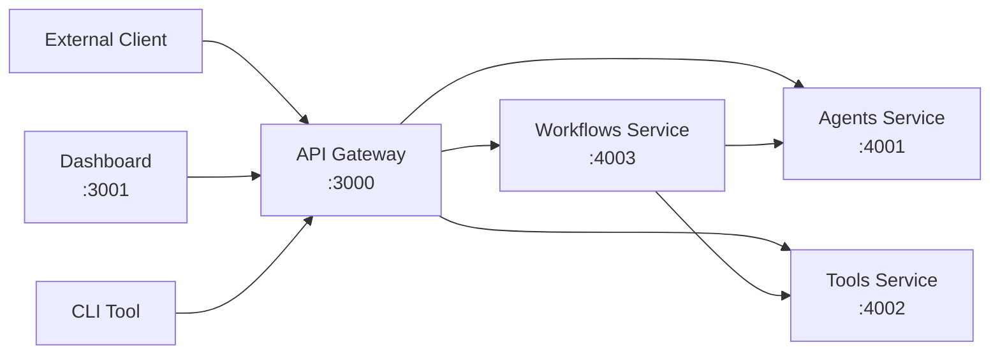

# Microservices API Reference Documentation

## Table of Contents
- [Overview](#overview)
- [Architecture](#architecture)
- [Service Endpoints](#service-endpoints)
- [Authentication](#authentication)
- [Common Response Formats](#common-response-formats)
- [Error Handling](#error-handling)
- [Rate Limiting](#rate-limiting)
- [API Gateway Endpoints](#api-gateway-endpoints)
- [Service-Specific APIs](#service-specific-apis)
  - [Agents Service API](#agents-service-api)
  - [Tools Service API](#tools-service-api)
  - [Workflows Service API](#workflows-service-api)
- [Dashboard API](#dashboard-api)
- [CLI Integration](#cli-integration)
- [WebSocket API](#websocket-api)
- [MCP Protocol](#mcp-protocol)
- [Examples](#examples)

## Overview

The Bedrock Agent System is built on a microservices architecture with separate services for API Gateway, Agents, Tools, and Workflows. Each service exposes its own API, with the API Gateway serving as the primary entry point for external clients.

### Key Features
- RESTful design with consistent resource naming
- JSON request/response format
- Comprehensive error handling
- WebSocket support for real-time operations
- MCP protocol implementation
- OpenAPI/Swagger documentation

## Architecture



## Service Endpoints

### Production URLs
```
# API Gateway (Public)
Base URL: https://api.mcp.example.com/v1

# Dashboard
URL: https://dashboard.mcp.example.com

# Individual Services (Internal Only)
Agents: http://agents.mcp.local:3001
Tools: http://tools.mcp.local:3002
Workflows: http://workflows.mcp.local:3003
```

### Development URLs
```
# API Gateway
Base URL: http://localhost:3000/api/v1

# Dashboard
URL: http://localhost:3001

# Services (Docker Compose)
Agents: http://localhost:4001
Tools: http://localhost:4002
Workflows: http://localhost:4003
```

## Authentication

### API Key Authentication
Some endpoints require API key authentication:

```http
Authorization: Bearer your-api-key-here
```

### MCP Authentication
MCP endpoints use the MCP protocol's built-in authentication mechanism.

## Common Response Formats

### Success Response
```json
{
  "success": true,
  "data": {
    // Response data
  },
  "metadata": {
    "timestamp": "2024-01-01T12:00:00.000Z",
    "requestId": "req_123456789"
  }
}
```

### Error Response
```json
{
  "success": false,
  "error": {
    "code": "ERROR_CODE",
    "message": "Human readable error message",
    "details": {
      // Additional error details
    }
  },
  "metadata": {
    "timestamp": "2024-01-01T12:00:00.000Z",
    "requestId": "req_123456789"
  }
}
```

## Error Handling

### HTTP Status Codes
- `200` - Success
- `201` - Created
- `400` - Bad Request
- `401` - Unauthorized
- `403` - Forbidden
- `404` - Not Found
- `409` - Conflict
- `422` - Unprocessable Entity
- `429` - Too Many Requests
- `500` - Internal Server Error
- `503` - Service Unavailable

### Error Codes
- `VALIDATION_ERROR` - Request validation failed
- `RESOURCE_NOT_FOUND` - Requested resource not found
- `WORKFLOW_ERROR` - Workflow execution failed
- `TOOL_EXECUTION_ERROR` - Tool execution failed
- `AGENT_ERROR` - Agent processing failed
- `MEMORY_ERROR` - Memory operation failed
- `MCP_ERROR` - MCP protocol error

## Rate Limiting

Default rate limits:
- 100 requests per minute per IP
- 1000 requests per hour per IP
- 10 concurrent workflow executions per client

Rate limit headers:
```http
X-RateLimit-Limit: 100
X-RateLimit-Remaining: 95
X-RateLimit-Reset: 1640995200
```

## Endpoints

### Health Endpoints

#### Get Overall Health Status
```http
GET /api/v1/health
```

**Response:**
```json
{
  "success": true,
  "data": {
    "status": "ok",
    "info": {
      "database": { "status": "up" },
      "memory": { "status": "up" },
      "bedrock": { "status": "up" }
    },
    "error": {},
    "details": {
      "database": { "status": "up" },
      "memory": { "status": "up" },
      "bedrock": { "status": "up" }
    }
  }
}
```

#### Get MCP Health Status
```http
GET /api/v1/health/mcp
```

**Response:**
```json
{
  "success": true,
  "data": {
    "status": "healthy",
    "server": {
      "enabled": true,
      "running": true,
      "connections": 5,
      "uptime": 3600000
    },
    "client": {
      "enabled": true,
      "totalConnections": 3,
      "activeConnections": 2,
      "connections": [
        {
          "id": "filesystem-1234567890",
          "name": "Filesystem",
          "status": "connected",
          "connectedAt": "2024-01-01T12:00:00.000Z"
        }
      ]
    }
  }
}
```

#### Test MCP Connection
```http
GET /api/v1/health/mcp/test/{connectionId}
```

**Response:**
```json
{
  "success": true,
  "data": {
    "connectionId": "filesystem-1234567890",
    "status": "healthy",
    "responseTime": 45,
    "lastCheck": "2024-01-01T12:00:00.000Z"
  }
}
```

## API Gateway Endpoints

The API Gateway handles request routing, authentication, rate limiting, and service discovery.

### Gateway Health Check
```http
GET /api/v1/health
```

**Response:**
```json
{
  "success": true,
  "data": {
    "status": "healthy",
    "services": {
      "agents": { "status": "up", "responseTime": 12 },
      "tools": { "status": "up", "responseTime": 8 },
      "workflows": { "status": "up", "responseTime": 15 }
    },
    "gateway": {
      "version": "1.0.0",
      "uptime": 3600000,
      "connections": 42
    }
  }
}
```

### Service Discovery
```http
GET /api/v1/services
```

**Response:**
```json
{
  "success": true,
  "data": {
    "services": [
      {
        "name": "agents",
        "status": "healthy",
        "endpoints": [
          { "id": "agents-1", "address": "10.0.1.10:3001", "healthy": true },
          { "id": "agents-2", "address": "10.0.1.11:3001", "healthy": true }
        ]
      },
      {
        "name": "tools",
        "status": "healthy",
        "endpoints": [
          { "id": "tools-1", "address": "10.0.1.20:3002", "healthy": true }
        ]
      },
      {
        "name": "workflows",
        "status": "healthy",
        "endpoints": [
          { "id": "workflows-1", "address": "10.0.1.30:3003", "healthy": true },
          { "id": "workflows-2", "address": "10.0.1.31:3003", "healthy": true }
        ]
      }
    ]
  }
}
```

## Service-Specific APIs

### Agents Service API

The Agents Service manages AI agent execution and Bedrock integration.

#### Execute Agent
```http
POST /api/v1/agents/{agentType}/execute
```

**Routed to:** `http://agents.mcp.local:3001/execute`

**Agent Types:**
- `code-analyzer`
- `db-analyzer`
- `knowledge-builder`
- `documentation-generator`

**Request Body:**
```json
{
  "prompt": "Analyze this code for security vulnerabilities",
  "context": {
    "filePath": "/path/to/file.js",
    "language": "javascript"
  },
  "options": {
    "temperature": 0.1,
    "maxTokens": 4096
  }
}
```

**Response:**
```json
{
  "success": true,
  "data": {
    "agentType": "code-analyzer",
    "executionId": "exec_1640995200_xyz789",
    "result": {
      "analysis": {
        "vulnerabilities": [],
        "codeQuality": {
          "score": 8.5,
          "metrics": {}
        }
      }
    },
    "executionTime": 2500,
    "tokensUsed": 1250,
    "serviceInfo": {
      "instanceId": "agents-1",
      "version": "1.0.0"
    }
  }
}
```

#### Get Agent Health
```http
GET /api/v1/agents/health
```

**Response:**
```json
{
  "success": true,
  "data": {
    "status": "healthy",
    "agents": {
      "code-analyzer": { "status": "ready", "lastExecution": "2024-01-01T12:00:00Z" },
      "db-analyzer": { "status": "ready", "lastExecution": "2024-01-01T11:55:00Z" },
      "knowledge-builder": { "status": "ready", "lastExecution": "2024-01-01T11:50:00Z" },
      "documentation-generator": { "status": "ready", "lastExecution": "2024-01-01T11:45:00Z" }
    },
    "bedrock": {
      "status": "connected",
      "region": "us-east-1",
      "model": "anthropic.claude-3-sonnet"
    }
  }
}
```

### Tools Service API

The Tools Service manages MCP tool registry and execution.

#### List Available Tools
```http
GET /api/v1/tools
```

**Routed to:** `http://tools.mcp.local:3002/list`

**Response:**
```json
{
  "success": true,
  "data": {
    "tools": [
      {
        "name": "code_analysis",
        "description": "Analyze code structure and quality",
        "category": "analysis",
        "source": "internal",
        "parameters": {
          "type": "object",
          "required": ["filePath"],
          "properties": {
            "filePath": {
              "type": "string",
              "description": "Path to the code file to analyze"
            }
          }
        }
      },
      {
        "name": "filesystem_read",
        "description": "Read file contents",
        "category": "filesystem",
        "source": "external:filesystem-server",
        "parameters": {
          "type": "object",
          "required": ["path"],
          "properties": {
            "path": {
              "type": "string",
              "description": "File path to read"
            }
          }
        }
      }
    ],
    "totalTools": 15,
    "sources": {
      "internal": 10,
      "external": 5
    }
  }
}
```

#### Execute Tool
```http
POST /api/v1/tools/{toolName}/execute
```

**Routed to:** `http://tools.mcp.local:3002/execute`

**Request Body:**
```json
{
  "parameters": {
    "filePath": "/path/to/file.js"
  },
  "context": {
    "userId": "user123",
    "sessionId": "session456",
    "correlationId": "corr789"
  }
}
```

### Workflows Service API

The Workflows Service manages LangGraph workflow orchestration.

#### Create Workflow
```http
POST /api/v1/workflows
```

**Routed to:** `http://workflows.mcp.local:3003/create`

**Request Body:**
```json
{
  "type": "code_analysis",
  "parameters": {
    "filePath": "/path/to/code/file.js",
    "options": {
      "includeTests": true,
      "generateDocs": true
    }
  },
  "metadata": {
    "priority": "high",
    "tags": ["security", "review"]
  }
}
```

**Response:**
```json
{
  "success": true,
  "data": {
    "workflowId": "workflow_1640995200_abc123",
    "type": "code_analysis",
    "status": "running",
    "createdAt": "2024-01-01T12:00:00.000Z",
    "estimatedCompletion": "2024-01-01T12:05:00.000Z"
  }
}
```

#### Get Workflow Status
```http
GET /api/v1/workflows/{workflowId}
```

**Response:**
```json
{
  "success": true,
  "data": {
    "workflowId": "workflow_1640995200_abc123",
    "type": "code_analysis",
    "status": "completed",
    "progress": 100,
    "currentStage": "documentation_generated",
    "createdAt": "2024-01-01T12:00:00.000Z",
    "completedAt": "2024-01-01T12:04:32.000Z",
    "result": {
      "codeAnalysis": {
        // Code analysis results
      },
      "documentation": {
        // Generated documentation
      }
    }
  }
}
```

#### List Workflows
```http
GET /api/v1/workflows?status=running&limit=10&offset=0
```

**Query Parameters:**
- `status` - Filter by status (running, completed, failed)
- `type` - Filter by workflow type
- `limit` - Number of results (default: 10, max: 100)
- `offset` - Pagination offset (default: 0)

**Response:**
```json
{
  "success": true,
  "data": {
    "workflows": [
      {
        "workflowId": "workflow_1640995200_abc123",
        "type": "code_analysis",
        "status": "running",
        "createdAt": "2024-01-01T12:00:00.000Z"
      }
    ],
    "pagination": {
      "total": 25,
      "limit": 10,
      "offset": 0,
      "hasMore": true
    }
  }
}
```

#### Cancel Workflow
```http
DELETE /api/v1/workflows/{workflowId}
```

**Response:**
```json
{
  "success": true,
  "data": {
    "workflowId": "workflow_1640995200_abc123",
    "status": "cancelled",
    "cancelledAt": "2024-01-01T12:02:00.000Z"
  }
}
```

### Agent Endpoints

#### Execute Agent
```http
POST /api/v1/agents/{agentType}/execute
```

**Agent Types:**
- `code-analyzer`
- `db-analyzer`
- `knowledge-builder`
- `documentation-generator`

**Request Body:**
```json
{
  "prompt": "Analyze this code for security vulnerabilities",
  "context": {
    "filePath": "/path/to/file.js",
    "language": "javascript"
  },
  "options": {
    "temperature": 0.1,
    "maxTokens": 4096
  }
}
```

**Response:**
```json
{
  "success": true,
  "data": {
    "agentType": "code-analyzer",
    "executionId": "exec_1640995200_xyz789",
    "result": {
      "analysis": {
        "vulnerabilities": [],
        "codeQuality": {
          "score": 8.5,
          "metrics": {}
        }
      }
    },
    "executionTime": 2500,
    "tokensUsed": 1250
  }
}
```

#### Get Agent Status
```http
GET /api/v1/agents/{agentType}/status
```

**Response:**
```json
{
  "success": true,
  "data": {
    "agentType": "code-analyzer",
    "status": "ready",
    "configuration": {
      "temperature": 0.1,
      "maxTokens": 4096
    },
    "metrics": {
      "totalExecutions": 150,
      "averageExecutionTime": 2200,
      "successRate": 0.95
    }
  }
}
```

### Tool Endpoints

#### List Available Tools
```http
GET /api/v1/tools
```

**Query Parameters:**
- `category` - Filter by tool category
- `search` - Search tool names and descriptions

**Response:**
```json
{
  "success": true,
  "data": {
    "tools": [
      {
        "name": "code_analysis",
        "description": "Analyze code structure and quality",
        "category": "analysis",
        "parameters": {
          "type": "object",
          "required": ["filePath"],
          "properties": {
            "filePath": {
              "type": "string",
              "description": "Path to the code file to analyze"
            }
          }
        },
        "timeout": 300000,
        "cacheable": true
      }
    ],
    "categories": ["analysis", "documentation", "database", "knowledge"]
  }
}
```

#### Execute Tool
```http
POST /api/v1/tools/{toolName}/execute
```

**Request Body:**
```json
{
  "parameters": {
    "filePath": "/path/to/file.js",
    "options": {
      "includeMetrics": true
    }
  },
  "context": {
    "userId": "user123",
    "sessionId": "session456"
  }
}
```

**Response:**
```json
{
  "success": true,
  "data": {
    "toolName": "code_analysis",
    "executionId": "tool_exec_1640995200_def456",
    "result": {
      // Tool-specific results
    },
    "executionTime": 1500,
    "cached": false
  }
}
```

#### Get Tool Metrics
```http
GET /api/v1/tools/{toolName}/metrics
```

**Response:**
```json
{
  "success": true,
  "data": {
    "toolName": "code_analysis",
    "metrics": {
      "totalExecutions": 100,
      "successfulExecutions": 95,
      "averageExecutionTime": 2200,
      "successRate": 0.95,
      "cacheHitRate": 0.35
    },
    "recentExecutions": [
      {
        "executionId": "tool_exec_1640995200_def456",
        "timestamp": "2024-01-01T12:00:00.000Z",
        "executionTime": 1500,
        "success": true
      }
    ]
  }
}
```

### Memory Endpoints

#### Store Memory
```http
POST /api/v1/memory
```

**Request Body:**
```json
{
  "content": "This is important information to remember",
  "contentType": "text",
  "metadata": {
    "source": "user_input",
    "category": "instruction",
    "tags": ["important", "configuration"]
  },
  "embedding": {
    "generate": true,
    "model": "amazon.titan-embed-text-v1"
  }
}
```

**Response:**
```json
{
  "success": true,
  "data": {
    "memoryId": "mem_1640995200_ghi789",
    "content": "This is important information to remember",
    "contentType": "text",
    "embedding": {
      "dimensions": 1536,
      "generated": true
    },
    "createdAt": "2024-01-01T12:00:00.000Z"
  }
}
```

#### Search Memory
```http
GET /api/v1/memory/search?q=configuration&limit=5&threshold=0.7
```

**Query Parameters:**
- `q` - Search query
- `limit` - Maximum results (default: 10, max: 50)
- `threshold` - Relevance threshold (0.0-1.0, default: 0.6)
- `contentType` - Filter by content type
- `category` - Filter by category

**Response:**
```json
{
  "success": true,
  "data": {
    "results": [
      {
        "memoryId": "mem_1640995200_ghi789",
        "content": "This is important information to remember",
        "relevanceScore": 0.85,
        "metadata": {
          "source": "user_input",
          "category": "instruction"
        },
        "createdAt": "2024-01-01T12:00:00.000Z"
      }
    ],
    "totalResults": 1,
    "searchTime": 45
  }
}
```

#### Get Memory by ID
```http
GET /api/v1/memory/{memoryId}
```

**Response:**
```json
{
  "success": true,
  "data": {
    "memoryId": "mem_1640995200_ghi789",
    "content": "This is important information to remember",
    "contentType": "text",
    "metadata": {
      "source": "user_input",
      "category": "instruction",
      "tags": ["important", "configuration"]
    },
    "embedding": {
      "dimensions": 1536,
      "model": "amazon.titan-embed-text-v1"
    },
    "createdAt": "2024-01-01T12:00:00.000Z",
    "accessCount": 3,
    "lastAccessed": "2024-01-01T12:15:00.000Z"
  }
}
```

#### Delete Memory
```http
DELETE /api/v1/memory/{memoryId}
```

**Response:**
```json
{
  "success": true,
  "data": {
    "memoryId": "mem_1640995200_ghi789",
    "deleted": true,
    "deletedAt": "2024-01-01T12:30:00.000Z"
  }
}
```

### MCP Endpoints

#### MCP Server Endpoint
```http
POST /mcp
```

This endpoint implements the full MCP protocol. See [MCP Protocol](#mcp-protocol) section for details.

#### List MCP Tools
```http
GET /api/v1/mcp/tools
```

**Response:**
```json
{
  "success": true,
  "data": {
    "tools": [
      {
        "name": "code_analysis",
        "description": "Analyze code structure and quality",
        "parameters": {
          "type": "object",
          "properties": {
            "filePath": {
              "type": "string",
              "description": "Path to the code file"
            }
          }
        }
      }
    ]
  }
}
```

#### Get MCP Server Info
```http
GET /api/v1/mcp/info
```

**Response:**
```json
{
  "success": true,
  "data": {
    "name": "hybrid-mcp-server",
    "version": "1.0.0",
    "description": "Advanced MCP server with NestJS and LangGraph integration",
    "protocolVersion": "2024-11-05",
    "capabilities": {
      "tools": true,
      "resources": false,
      "prompts": false
    },
    "serverInfo": {
      "connections": 5,
      "uptime": 3600000,
      "toolsAvailable": 15
    }
  }
}
```

## WebSocket API

### Connection
```javascript
const ws = new WebSocket('ws://localhost:3000/ws');
```

### Message Format
```json
{
  "type": "workflow_update",
  "data": {
    "workflowId": "workflow_1640995200_abc123",
    "status": "running",
    "progress": 25,
    "currentStage": "code_analysis"
  },
  "timestamp": "2024-01-01T12:01:00.000Z"
}
```

### Subscription
```json
{
  "action": "subscribe",
  "types": ["workflow_update", "tool_execution"],
  "filters": {
    "workflowId": "workflow_1640995200_abc123"
  }
}
```

### Message Types
- `workflow_update` - Workflow status changes
- `tool_execution` - Tool execution events
- `agent_status` - Agent status updates
- `system_status` - System health updates
- `error` - Error notifications

## MCP Protocol

The system implements the Model Context Protocol (MCP) specification version 2024-11-05.

### Supported Methods

#### initialize
Initialize the MCP connection.

**Request:**
```json
{
  "jsonrpc": "2.0",
  "id": 1,
  "method": "initialize",
  "params": {
    "protocolVersion": "2024-11-05",
    "capabilities": {
      "tools": {}
    },
    "clientInfo": {
      "name": "test-client",
      "version": "1.0.0"
    }
  }
}
```

**Response:**
```json
{
  "jsonrpc": "2.0",
  "id": 1,
  "result": {
    "protocolVersion": "2024-11-05",
    "capabilities": {
      "tools": {
        "listChanged": true
      }
    },
    "serverInfo": {
      "name": "hybrid-mcp-server",
      "version": "1.0.0"
    }
  }
}
```

#### tools/list
List available tools.

**Request:**
```json
{
  "jsonrpc": "2.0",
  "id": 2,
  "method": "tools/list"
}
```

**Response:**
```json
{
  "jsonrpc": "2.0",
  "id": 2,
  "result": {
    "tools": [
      {
        "name": "code_analysis",
        "description": "Analyze code structure and quality",
        "inputSchema": {
          "type": "object",
          "properties": {
            "filePath": {
              "type": "string",
              "description": "Path to the code file"
            }
          },
          "required": ["filePath"]
        }
      }
    ]
  }
}
```

#### tools/call
Execute a tool.

**Request:**
```json
{
  "jsonrpc": "2.0",
  "id": 3,
  "method": "tools/call",
  "params": {
    "name": "code_analysis",
    "arguments": {
      "filePath": "/path/to/file.js"
    }
  }
}
```

**Response:**
```json
{
  "jsonrpc": "2.0",
  "id": 3,
  "result": {
    "content": [
      {
        "type": "text",
        "text": "Code analysis completed successfully"
      }
    ],
    "isError": false
  }
}
```

## Dashboard API

The Dashboard communicates with the API Gateway using both REST and WebSocket connections.

### Dashboard Configuration
```typescript
// Dashboard API client configuration
const apiClient = {
  baseURL: process.env.NEXT_PUBLIC_API_URL || 'https://api.mcp.example.com/v1',
  wsURL: process.env.NEXT_PUBLIC_WS_URL || 'wss://api.mcp.example.com/ws',
  headers: {
    'X-Dashboard-Version': '1.0.0',
    'X-Client-Type': 'dashboard'
  }
};
```

### Dashboard-Specific Endpoints

#### Get Dashboard Metrics
```http
GET /api/v1/dashboard/metrics
```

**Response:**
```json
{
  "success": true,
  "data": {
    "workflows": {
      "total": 150,
      "running": 5,
      "completed": 140,
      "failed": 5
    },
    "agents": {
      "executions": 450,
      "averageTime": 2500,
      "successRate": 0.95
    },
    "tools": {
      "executions": 1200,
      "topTools": [
        { "name": "code_analysis", "count": 350 },
        { "name": "generate_docs", "count": 280 }
      ]
    },
    "system": {
      "uptime": 3600000,
      "activeConnections": 42
    }
  }
}
```

## CLI Integration

The CLI tool connects to the API Gateway for all operations.

### CLI Authentication
```bash
# Set API key
mcp-cli config set api-key YOUR_API_KEY

# Set API endpoint
mcp-cli config set api-url https://api.mcp.example.com/v1
```

### CLI API Usage
```bash
# Execute workflow
mcp-cli api POST /workflows \
  --data '{"type":"code_analysis","parameters":{"filePath":"./src/main.ts"}}'

# Get workflow status
mcp-cli api GET /workflows/workflow_123

# Execute tool
mcp-cli api POST /tools/code_analysis/execute \
  --data '{"parameters":{"filePath":"./src/main.ts"}}'
```

## Examples

### Complete Microservices Workflow

1. **Client Request to API Gateway:**
```bash
curl -X POST https://api.mcp.example.com/v1/workflows \
  -H "Content-Type: application/json" \
  -H "Authorization: Bearer YOUR_API_KEY" \
  -d '{
    "type": "code_analysis",
    "parameters": {
      "filePath": "/src/app.js",
      "options": {
        "includeTests": true,
        "generateDocs": true
      }
    }
  }'
```

2. **API Gateway Routes to Workflows Service:**
```
Gateway -> Service Discovery -> Workflows Service (Round-robin selection)
```

3. **Workflows Service Orchestrates:**
```
Workflows -> Agents Service (Code Analysis)
Workflows -> Agents Service (Documentation Generation)
Workflows -> Tools Service (File Operations)
```

2. **Monitor Progress:**
```bash
curl http://localhost:3000/api/v1/workflows/workflow_1640995200_abc123
```

3. **Get Results:**
```bash
curl http://localhost:3000/api/v1/workflows/workflow_1640995200_abc123/result
```

### Memory-Based Question Answering

1. **Store Knowledge:**
```bash
curl -X POST http://localhost:3000/api/v1/memory \
  -H "Content-Type: application/json" \
  -d '{
    "content": "The application uses JWT tokens for authentication",
    "metadata": {
      "category": "architecture",
      "tags": ["authentication", "security"]
    }
  }'
```

2. **Search and Retrieve:**
```bash
curl "http://localhost:3000/api/v1/memory/search?q=authentication&limit=5"
```

3. **Use in Agent:**
```bash
curl -X POST http://localhost:3000/api/v1/agents/knowledge-builder/execute \
  -H "Content-Type: application/json" \
  -d '{
    "prompt": "How does authentication work in this application?",
    "context": {
      "useMemory": true,
      "memorySearch": "authentication security"
    }
  }'
```

### MCP Tool Integration

1. **List Tools via MCP:**
```javascript
const mcpClient = new MCPClient('http://localhost:3000/mcp');
const tools = await mcpClient.request('tools/list');
console.log(tools);
```

2. **Execute Tool via MCP:**
```javascript
const result = await mcpClient.request('tools/call', {
  name: 'code_analysis',
  arguments: {
    filePath: '/src/app.js'
  }
});
console.log(result);
```

### Service Health Monitoring

```bash
# Check overall system health
curl https://api.mcp.example.com/v1/health

# Check specific service health
curl https://api.mcp.example.com/v1/agents/health
curl https://api.mcp.example.com/v1/tools/health
curl https://api.mcp.example.com/v1/workflows/health
```

### Dashboard WebSocket Connection

```javascript
// Dashboard WebSocket connection with auto-reconnect
class DashboardWebSocket {
  constructor(url) {
    this.url = url;
    this.reconnectInterval = 5000;
    this.shouldReconnect = true;
    this.connect();
  }

  connect() {
    this.ws = new WebSocket(this.url);
    
    this.ws.onopen = () => {
      console.log('Dashboard connected to WebSocket');
      
      // Subscribe to all relevant events
      this.ws.send(JSON.stringify({
        action: 'subscribe',
        types: ['workflow_update', 'service_health', 'system_metrics'],
        clientType: 'dashboard'
      }));
    };
    
    this.ws.onmessage = (event) => {
      const message = JSON.parse(event.data);
      
      switch(message.type) {
        case 'workflow_update':
          this.handleWorkflowUpdate(message.data);
          break;
        case 'service_health':
          this.handleServiceHealth(message.data);
          break;
        case 'system_metrics':
          this.handleSystemMetrics(message.data);
          break;
      }
    };
    
    this.ws.onclose = () => {
      if (this.shouldReconnect) {
        setTimeout(() => this.connect(), this.reconnectInterval);
      }
    };
  }
  
  handleWorkflowUpdate(data) {
    // Update dashboard workflow status
    console.log('Workflow update:', data);
  }
  
  handleServiceHealth(data) {
    // Update service health indicators
    console.log('Service health:', data);
  }
  
  handleSystemMetrics(data) {
    // Update system metrics charts
    console.log('System metrics:', data);
  }
}

// Initialize dashboard WebSocket
const dashboardWS = new DashboardWebSocket('wss://api.mcp.example.com/ws');
```

### CLI Tool Integration Example

```bash
#!/bin/bash
# Example: Complete workflow execution via CLI

# 1. Create workflow
WORKFLOW_ID=$(mcp-cli workflow create code-analysis \
  --file ./src/main.ts \
  --include-tests \
  --generate-docs \
  --json | jq -r '.workflowId')

echo "Created workflow: $WORKFLOW_ID"

# 2. Monitor workflow progress
while true; do
  STATUS=$(mcp-cli workflow status $WORKFLOW_ID --json | jq -r '.status')
  PROGRESS=$(mcp-cli workflow status $WORKFLOW_ID --json | jq -r '.progress')
  
  echo "Status: $STATUS, Progress: $PROGRESS%"
  
  if [ "$STATUS" = "completed" ] || [ "$STATUS" = "failed" ]; then
    break
  fi
  
  sleep 2
done

# 3. Get results
if [ "$STATUS" = "completed" ]; then
  mcp-cli workflow result $WORKFLOW_ID --output ./analysis-result.json
  echo "Analysis complete. Results saved to analysis-result.json"
else
  echo "Workflow failed"
  mcp-cli workflow logs $WORKFLOW_ID
fi
```

## SDK and Client Libraries

### Node.js SDK
```javascript
import { BedrockAgentClient } from '@bedrock-agent-system/client';

const client = new BedrockAgentClient({
  baseUrl: 'http://localhost:3000/api/v1',
  apiKey: 'your-api-key'
});

// Execute workflow
const workflow = await client.workflows.create({
  type: 'code_analysis',
  parameters: { filePath: '/src/app.js' }
});

// Monitor progress
const status = await client.workflows.get(workflow.workflowId);
```

### Python SDK
```python
from bedrock_agent_client import BedrockAgentClient

client = BedrockAgentClient(
    base_url='http://localhost:3000/api/v1',
    api_key='your-api-key'
)

# Execute agent
result = client.agents.execute(
    agent_type='code-analyzer',
    prompt='Analyze this code',
    context={'filePath': '/src/app.js'}
)
```

### cURL Examples
See the [Examples](#examples) section for comprehensive cURL usage examples.

## Rate Limiting and Quotas

### Default Limits
- API requests: 100/minute, 1000/hour
- Workflow executions: 10 concurrent
- Tool executions: 50/minute
- Memory operations: 200/minute

### Custom Limits
Contact support for enterprise quotas and custom rate limits.

## Changelog

### v1.0.0
- Initial API release
- Core workflow, agent, tool, and memory endpoints
- MCP protocol implementation
- WebSocket real-time updates

### Future Versions
- Enhanced search capabilities
- Batch operation support
- Advanced analytics endpoints
- Additional MCP features