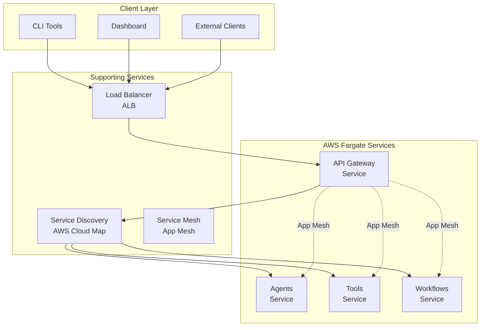

# Microservices Deployment Guide

## Table of Contents
- [Overview](#overview)
- [Microservices Architecture](#microservices-architecture)
- [Prerequisites](#prerequisites)
- [Environment Setup](#environment-setup)
- [Local Development](#local-development)
- [Staging Deployment](#staging-deployment)
- [Production Deployment](#production-deployment)
- [AWS Fargate Infrastructure](#aws-fargate-infrastructure)
- [Service Deployment](#service-deployment)
- [Dashboard Deployment](#dashboard-deployment)
- [CLI Deployment](#cli-deployment)
- [Monitoring and Logging](#monitoring-and-logging)
- [Service Discovery](#service-discovery)
- [Scaling Strategies](#scaling-strategies)
- [Troubleshooting](#troubleshooting)

## Overview

This guide covers deploying the Bedrock Agent System as a distributed microservices architecture on AWS Fargate. The system consists of separate services for API Gateway, Agents, Tools, Workflows, along with a Next.js Dashboard and CLI tools.

### Deployment Architecture
- **API Gateway**: Entry point for all requests, deployed on Fargate
- **Microservices**: Agents, Tools, and Workflows as separate Fargate services
- **Dashboard**: Next.js app deployed on Vercel/AWS Amplify/Fargate
- **CLI Tools**: Distributed as npm package or Docker container
- **Service Mesh**: AWS App Mesh for inter-service communication

## Prerequisites

### System Requirements
- **CPU**: Minimum 2 cores, Recommended 4+ cores
- **Memory**: Minimum 4GB RAM, Recommended 8GB+ RAM
- **Storage**: Minimum 20GB, Recommended 50GB+ SSD
- **Network**: Stable internet connection for AWS services

### Required Software
- Docker 20.0+
- Docker Compose 2.0+
- Node.js 18+
- pnpm 8+
- AWS CLI 2.0+
- Terraform 1.5+ (for infrastructure)

### AWS Prerequisites
- AWS Account with appropriate permissions
- AWS CLI configured with credentials
- S3 bucket for deployment artifacts
- Route53 hosted zone (for production)

## Environment Setup

### Environment Variables

Create environment files for each deployment target:

#### `.env.development`
```bash
# Server Configuration
NODE_ENV=development
PORT=3000
HOST=0.0.0.0
LOG_LEVEL=debug

# AWS Configuration (LocalStack)
AWS_REGION=us-east-1
AWS_ENDPOINT_URL=http://localhost:4566
AWS_ACCESS_KEY_ID=test
AWS_SECRET_ACCESS_KEY=test

# Database Configuration (LocalStack)
AWS_DYNAMODB_ENDPOINT=http://localhost:4566
DYNAMODB_METADATA_TABLE=MCPMetadata-dev
DYNAMODB_WORKFLOW_STATE_TABLE=MCPWorkflowState-dev

# S3 Configuration (LocalStack)
AWS_S3_BUCKET=mcp-hybrid-server-data-dev
AWS_S3_ENDPOINT=http://localhost:4566

# OpenSearch Configuration (LocalStack)
AWS_OPENSEARCH_ENDPOINT=http://localhost:4566
OPENSEARCH_INDEX_PREFIX=mcp-dev

# Bedrock Configuration (LocalStack)
AWS_BEDROCK_ENDPOINT=http://localhost:4566
AWS_BEDROCK_MODEL_ID=anthropic.claude-3-sonnet-20240229-v1:0

# MCP Configuration
MCP_SERVER_ENABLED=true
MCP_CLIENT_ENABLED=true
MCP_CLIENT_AUTO_CONNECT=true
MCP_ENABLE_LOGGING=true
```

#### `.env.staging`
```bash
# Server Configuration
NODE_ENV=staging
PORT=3000
HOST=0.0.0.0
LOG_LEVEL=info

# AWS Configuration
AWS_REGION=us-east-1

# Database Configuration
DYNAMODB_METADATA_TABLE=MCPMetadata-staging
DYNAMODB_WORKFLOW_STATE_TABLE=MCPWorkflowState-staging

# S3 Configuration
AWS_S3_BUCKET=mcp-hybrid-server-data-staging

# OpenSearch Configuration
AWS_OPENSEARCH_ENDPOINT=${OPENSEARCH_ENDPOINT_STAGING}
OPENSEARCH_INDEX_PREFIX=mcp-staging

# Bedrock Configuration
AWS_BEDROCK_MODEL_ID=anthropic.claude-3-sonnet-20240229-v1:0

# MCP Configuration
MCP_SERVER_ENABLED=true
MCP_CLIENT_ENABLED=true
MCP_SERVER_MAX_CONNECTIONS=50
```

#### `.env.production`
```bash
# Server Configuration
NODE_ENV=production
PORT=3000
HOST=0.0.0.0
LOG_LEVEL=warn

# AWS Configuration
AWS_REGION=us-east-1

# Database Configuration
DYNAMODB_METADATA_TABLE=MCPMetadata-prod
DYNAMODB_WORKFLOW_STATE_TABLE=MCPWorkflowState-prod

# S3 Configuration
AWS_S3_BUCKET=mcp-hybrid-server-data-prod

# OpenSearch Configuration
AWS_OPENSEARCH_ENDPOINT=${OPENSEARCH_ENDPOINT_PROD}
OPENSEARCH_INDEX_PREFIX=mcp-prod

# Bedrock Configuration
AWS_BEDROCK_MODEL_ID=anthropic.claude-3-sonnet-20240229-v1:0

# MCP Configuration
MCP_SERVER_ENABLED=true
MCP_CLIENT_ENABLED=true
MCP_SERVER_MAX_CONNECTIONS=200
MCP_ENABLE_METRICS=true

# Production-specific
ENABLE_FILE_LOGGING=true
LOG_DIRECTORY=/var/log/mcp-hybrid-server
```

### Secrets Management

Use AWS Systems Manager Parameter Store for sensitive configuration:

```bash
# Store secrets
aws ssm put-parameter \
  --name "/mcp-hybrid-server/prod/database-url" \
  --value "your-database-url" \
  --type "SecureString"

# Retrieve in application
DATABASE_URL=$(aws ssm get-parameter \
  --name "/mcp-hybrid-server/prod/database-url" \
  --with-decryption \
  --query 'Parameter.Value' \
  --output text)
```

## Local Development

### Using Docker Compose

1. **Setup LocalStack for AWS Services:**
```bash
# Start LocalStack
docker-compose -f docker-compose.localstack.yml up -d

# Verify services
curl http://localhost:4566/health
```

2. **Start the Application:**
```bash
# Install dependencies
pnpm install

# Start in development mode
pnpm dev

# Or using Docker Compose
docker-compose -f docker-compose.dev.yml up
```

3. **Initialize Local Environment:**
```bash
# Setup MCP configuration
./scripts/setup-local-dev.sh

# Create initial data
./scripts/init-local-data.sh
```

### Development Workflow

```bash
# Start development environment
pnpm dev

# Run tests
pnpm test
pnpm test:e2e

# Build application
pnpm build

# Start production build locally
pnpm start:prod
```

### Hot Reload and Debugging

The development setup includes:
- Hot reload with nodemon
- Source map support
- Debug logging
- API documentation at `/api/docs`

## Staging Deployment

### AWS ECS Deployment

1. **Build and Push Docker Image:**
```bash
# Build image
docker build -t mcp-hybrid-server:staging .

# Tag for ECR
docker tag mcp-hybrid-server:staging \
  123456789012.dkr.ecr.us-east-1.amazonaws.com/mcp-hybrid-server:staging

# Push to ECR
aws ecr get-login-password --region us-east-1 | \
  docker login --username AWS --password-stdin \
  123456789012.dkr.ecr.us-east-1.amazonaws.com

docker push 123456789012.dkr.ecr.us-east-1.amazonaws.com/mcp-hybrid-server:staging
```

2. **Deploy Infrastructure:**
```bash
cd infrastructure/mcp-hybrid-stack

# Install dependencies
pnpm install

# Deploy staging stack
cdk deploy McpHybridStack-staging \
  --parameters Environment=staging \
  --parameters ImageTag=staging
```

3. **Deploy Application:**
```bash
# Update ECS service
aws ecs update-service \
  --cluster mcp-hybrid-cluster-staging \
  --service mcp-hybrid-service-staging \
  --force-new-deployment
```

### Staging Configuration

```yaml
# staging-config.yml
environment: staging
replica_count: 2
cpu: 1024
memory: 2048
autoscaling:
  min_capacity: 1
  max_capacity: 4
  target_cpu: 70
database:
  backup_retention: 7
monitoring:
  log_retention: 30
```

## Production Deployment

### Blue-Green Deployment Strategy

1. **Prepare Blue Environment:**
```bash
# Deploy new version to blue environment
./deployment/deploy.sh prod blue

# Verify deployment
./deployment/health-check.sh prod blue
```

2. **Switch Traffic:**
```bash
# Gradually shift traffic
./deployment/traffic-shift.sh prod blue 10  # 10% traffic
./deployment/traffic-shift.sh prod blue 50  # 50% traffic
./deployment/traffic-shift.sh prod blue 100 # 100% traffic
```

3. **Complete Deployment:**
```bash
# Terminate green environment
./deployment/cleanup.sh prod green
```

### Production Configuration

```yaml
# production-config.yml
environment: production
replica_count: 6
cpu: 2048
memory: 4096
autoscaling:
  min_capacity: 3
  max_capacity: 20
  target_cpu: 60
database:
  backup_retention: 30
  multi_az: true
monitoring:
  log_retention: 90
  alerting: enabled
security:
  waf_enabled: true
  ssl_termination: alb
  vpc_logs: enabled
```

### Automated Production Deployment

```bash
#!/bin/bash
# deployment/deploy.sh

set -e

ENVIRONMENT=$1
VERSION=$2

echo "Deploying to $ENVIRONMENT with version $VERSION"

# Pre-deployment checks
./scripts/pre-deployment-checks.sh $ENVIRONMENT

# Build and push image
docker build -t mcp-hybrid-server:$VERSION .
./scripts/push-to-ecr.sh $VERSION $ENVIRONMENT

# Deploy infrastructure changes
cd infrastructure/mcp-hybrid-stack
cdk deploy McpHybridStack-$ENVIRONMENT \
  --parameters Environment=$ENVIRONMENT \
  --parameters ImageTag=$VERSION \
  --require-approval never

# Update ECS service
aws ecs update-service \
  --cluster mcp-hybrid-cluster-$ENVIRONMENT \
  --service mcp-hybrid-service-$ENVIRONMENT \
  --task-definition mcp-hybrid-task-$ENVIRONMENT:$VERSION \
  --force-new-deployment

# Wait for deployment to complete
aws ecs wait services-stable \
  --cluster mcp-hybrid-cluster-$ENVIRONMENT \
  --services mcp-hybrid-service-$ENVIRONMENT

# Run post-deployment tests
./scripts/post-deployment-tests.sh $ENVIRONMENT

echo "Deployment completed successfully"
```

## Microservices Architecture

### Service Breakdown



### Service Responsibilities

1. **API Gateway Service**
   - Request routing and load balancing
   - Authentication and authorization
   - Rate limiting and throttling
   - WebSocket connection management
   - Service discovery integration

2. **Agents Service**
   - Code Analyzer Agent execution
   - Database Analyzer Agent execution
   - Knowledge Builder Agent execution
   - Documentation Generator Agent execution
   - Bedrock AI integration

3. **Tools Service**
   - MCP tool registry management
   - Tool execution and validation
   - External MCP server connections
   - Tool permission management

4. **Workflows Service**
   - LangGraph workflow orchestration
   - State persistence with DynamoDB
   - Workflow monitoring and recovery
   - Inter-service coordination

## AWS Fargate Infrastructure

### Core Infrastructure Components

#### VPC Configuration for Microservices
```typescript
// infrastructure/lib/vpc-stack.ts
const vpc = new ec2.Vpc(this, 'McpMicroservicesVpc', {
  vpcName: 'mcp-microservices-vpc',
  cidr: '10.0.0.0/16',
  maxAzs: 3,
  natGateways: 2,
  subnetConfiguration: [
    {
      cidrMask: 24,
      name: 'Public',
      subnetType: ec2.SubnetType.PUBLIC,
    },
    {
      cidrMask: 24,
      name: 'Private',
      subnetType: ec2.SubnetType.PRIVATE_WITH_EGRESS,
    },
    {
      cidrMask: 28,
      name: 'Isolated',
      subnetType: ec2.SubnetType.PRIVATE_ISOLATED,
    },
  ],
});
```

#### ECS Cluster for Microservices
```typescript
// infrastructure/lib/microservices-stack.ts
export class MicroservicesStack extends Stack {
  constructor(scope: Construct, id: string, props: StackProps) {
    super(scope, id, props);

    // Create ECS Cluster
    const cluster = new ecs.Cluster(this, 'McpMicroservicesCluster', {
      vpc,
      clusterName: 'mcp-microservices',
      containerInsights: true,
      enableFargateCapacityProviders: true,
    });

    // Service Discovery Namespace
    const namespace = new servicediscovery.PrivateDnsNamespace(this, 'McpNamespace', {
      name: 'mcp.local',
      vpc,
    });

    // Create services
    this.createGatewayService(cluster, namespace);
    this.createAgentsService(cluster, namespace);
    this.createToolsService(cluster, namespace);
    this.createWorkflowsService(cluster, namespace);
  }

  private createGatewayService(cluster: ecs.Cluster, namespace: servicediscovery.PrivateDnsNamespace) {
    const taskDefinition = new ecs.FargateTaskDefinition(this, 'GatewayTaskDef', {
      memoryLimitMiB: 1024,
      cpu: 512,
    });

    const container = taskDefinition.addContainer('gateway', {
      image: ecs.ContainerImage.fromRegistry('your-ecr-repo/gateway:latest'),
      logging: ecs.LogDrivers.awsLogs({
        streamPrefix: 'gateway',
        logGroup: new logs.LogGroup(this, 'GatewayLogGroup', {
          logGroupName: '/ecs/mcp/gateway',
          retention: logs.RetentionDays.ONE_WEEK,
        }),
      }),
      environment: {
        SERVICE_DISCOVERY_NAMESPACE: 'mcp.local',
        NODE_ENV: 'production',
      },
      portMappings: [{ containerPort: 3000 }],
    });

    const service = new ecs.FargateService(this, 'GatewayService', {
      cluster,
      taskDefinition,
      desiredCount: 2,
      serviceName: 'gateway',
      cloudMapOptions: {
        name: 'gateway',
        dnsRecordType: servicediscovery.DnsRecordType.A,
        cloudMapNamespace: namespace,
      },
    });

    // Auto-scaling
    const scalableTarget = service.autoScaleTaskCount({
      minCapacity: 2,
      maxCapacity: 10,
    });

    scalableTarget.scaleOnCpuUtilization('CpuScaling', {
      targetUtilizationPercent: 70,
    });
  }
}

#### Application Load Balancer
```typescript
// infrastructure/lib/alb-stack.ts
const alb = new elbv2.ApplicationLoadBalancer(this, 'McpALB', {
  vpc,
  internetFacing: true,
  loadBalancerName: 'mcp-hybrid-alb',
});

const targetGroup = new elbv2.ApplicationTargetGroup(this, 'McpTargetGroup', {
  vpc,
  port: 3000,
  protocol: elbv2.ApplicationProtocol.HTTP,
  targetType: elbv2.TargetType.IP,
  healthCheck: {
    path: '/api/v1/health',
    healthyHttpCodes: '200',
  },
});
```

### AWS Services Configuration

#### DynamoDB Tables
```typescript
const metadataTable = new dynamodb.Table(this, 'MetadataTable', {
  tableName: `MCPMetadata-${props.environment}`,
  partitionKey: { name: 'id', type: dynamodb.AttributeType.STRING },
  sortKey: { name: 'type', type: dynamodb.AttributeType.STRING },
  billingMode: dynamodb.BillingMode.PAY_PER_REQUEST,
  pointInTimeRecovery: true,
  encryption: dynamodb.TableEncryption.AWS_MANAGED,
});

const workflowStateTable = new dynamodb.Table(this, 'WorkflowStateTable', {
  tableName: `MCPWorkflowState-${props.environment}`,
  partitionKey: { name: 'workflowId', type: dynamodb.AttributeType.STRING },
  billingMode: dynamodb.BillingMode.PAY_PER_REQUEST,
  timeToLiveAttribute: 'ttl',
});
```

#### S3 Bucket
```typescript
const dataBucket = new s3.Bucket(this, 'DataBucket', {
  bucketName: `mcp-hybrid-server-data-${props.environment}`,
  versioned: true,
  encryption: s3.BucketEncryption.S3_MANAGED,
  blockPublicAccess: s3.BlockPublicAccess.BLOCK_ALL,
  lifecycleRules: [
    {
      id: 'DeleteOldVersions',
      expiredObjectDeleteMarker: true,
      noncurrentVersionExpiration: Duration.days(30),
    },
  ],
});
```

#### OpenSearch Serverless
```typescript
const searchCollection = new opensearch.CfnCollection(this, 'SearchCollection', {
  name: `mcp-search-${props.environment}`,
  type: 'VECTORSEARCH',
  description: 'Vector search for MCP hybrid server',
});
```

### Infrastructure Deployment

```bash
# Deploy all infrastructure
cd infrastructure/mcp-hybrid-stack

# Install dependencies
pnpm install

# Bootstrap CDK (first time only)
cdk bootstrap aws://123456789012/us-east-1

# Deploy development environment
cdk deploy McpHybridStack-dev

# Deploy staging environment
cdk deploy McpHybridStack-staging

# Deploy production environment
cdk deploy McpHybridStack-prod
```

## Service Deployment

### Microservice Dockerfiles

#### Gateway Service Dockerfile
```dockerfile
# docker/Dockerfile.gateway
FROM node:20-alpine AS base
WORKDIR /app

FROM base AS deps
COPY apps/mcp-hybrid-server/package*.json ./
COPY apps/mcp-hybrid-server/docker/gateway/package*.json ./docker/gateway/
RUN npm ci --only=production

FROM base AS builder
COPY apps/mcp-hybrid-server ./
RUN npm ci && npm run build:gateway

FROM base AS runner
RUN addgroup -g 1001 -S nodejs
RUN adduser -S nestjs -u 1001

COPY --from=deps --chown=nestjs:nodejs /app/node_modules ./node_modules
COPY --from=builder --chown=nestjs:nodejs /app/dist/gateway ./dist
COPY --from=builder --chown=nestjs:nodejs /app/docker/gateway/package.json ./

USER nestjs
EXPOSE 3000

ENV NODE_ENV=production
CMD ["node", "dist/main-gateway.js"]
```

#### Agents Service Dockerfile
```dockerfile
# docker/Dockerfile.agents
FROM node:20-alpine AS base
WORKDIR /app

FROM base AS deps
COPY apps/mcp-hybrid-server/package*.json ./
COPY apps/mcp-hybrid-server/docker/agents/package*.json ./docker/agents/
RUN npm ci --only=production

FROM base AS builder
COPY apps/mcp-hybrid-server ./
RUN npm ci && npm run build:agents

FROM base AS runner
RUN addgroup -g 1001 -S nodejs
RUN adduser -S nestjs -u 1001

COPY --from=deps --chown=nestjs:nodejs /app/node_modules ./node_modules
COPY --from=builder --chown=nestjs:nodejs /app/dist/agents ./dist
COPY --from=builder --chown=nestjs:nodejs /app/docker/agents/package.json ./

USER nestjs
EXPOSE 3001

ENV NODE_ENV=production
CMD ["node", "dist/main-agents.js"]
```

### Fargate Task Definitions

#### Gateway Service Task Definition
```json
{
  "family": "mcp-gateway-service",
  "networkMode": "awsvpc",
  "requiresCompatibilities": ["FARGATE"],
  "cpu": "512",
  "memory": "1024",
  "taskRoleArn": "arn:aws:iam::123456789012:role/mcp-gateway-task-role",
  "executionRoleArn": "arn:aws:iam::123456789012:role/mcp-gateway-execution-role",
  "containerDefinitions": [
    {
      "name": "gateway",
      "image": "123456789012.dkr.ecr.us-east-1.amazonaws.com/mcp-gateway:latest",
      "portMappings": [
        {
          "containerPort": 3000,
          "protocol": "tcp"
        }
      ],
      "environment": [
        {"name": "SERVICE_DISCOVERY_NAMESPACE", "value": "mcp.local"},
        {"name": "NODE_ENV", "value": "production"},
        {"name": "AGENTS_SERVICE_URL", "value": "http://agents.mcp.local:3001"},
        {"name": "TOOLS_SERVICE_URL", "value": "http://tools.mcp.local:3002"},
        {"name": "WORKFLOWS_SERVICE_URL", "value": "http://workflows.mcp.local:3003"}
      ],
      "secrets": [
        {
          "name": "API_KEY",
          "valueFrom": "arn:aws:secretsmanager:us-east-1:123456789012:secret:mcp/gateway/api-key"
        }
      ],
      "logConfiguration": {
        "logDriver": "awslogs",
        "options": {
          "awslogs-group": "/ecs/mcp-gateway",
          "awslogs-region": "us-east-1",
          "awslogs-stream-prefix": "gateway"
        }
      },
      "healthCheck": {
        "command": ["CMD-SHELL", "curl -f http://localhost:3000/health || exit 1"],
        "interval": 30,
        "timeout": 5,
        "retries": 3,
        "startPeriod": 60
      }
    }
  ]
}
```

### Service Deployment Scripts

```bash
#!/bin/bash
# deployment/deploy-microservices.sh

set -e

ENVIRONMENT=${1:-staging}
SERVICE=${2:-all}

echo "Deploying to $ENVIRONMENT environment"

# Function to deploy a service
deploy_service() {
    local service_name=$1
    local ecr_repo="123456789012.dkr.ecr.us-east-1.amazonaws.com/mcp-$service_name"
    
    echo "Building $service_name service..."
    docker build -f docker/Dockerfile.$service_name -t $ecr_repo:latest .
    
    echo "Pushing $service_name to ECR..."
    aws ecr get-login-password --region us-east-1 | docker login --username AWS --password-stdin $ecr_repo
    docker push $ecr_repo:latest
    
    echo "Updating $service_name service in ECS..."
    aws ecs update-service \
        --cluster mcp-microservices-$ENVIRONMENT \
        --service mcp-$service_name-$ENVIRONMENT \
        --force-new-deployment
    
    echo "Waiting for $service_name to stabilize..."
    aws ecs wait services-stable \
        --cluster mcp-microservices-$ENVIRONMENT \
        --services mcp-$service_name-$ENVIRONMENT
}

# Deploy services
if [ "$SERVICE" == "all" ]; then
    deploy_service "gateway"
    deploy_service "agents"
    deploy_service "tools"
    deploy_service "workflows"
else
    deploy_service "$SERVICE"
fi

echo "Deployment complete!"
```

### Docker Compose for Production

```yaml
# docker-compose.prod.yml
version: '3.8'

services:
  mcp-hybrid-server:
    build:
      context: .
      dockerfile: Dockerfile
    ports:
      - "3000:3000"
    environment:
      - NODE_ENV=production
      - AWS_REGION=${AWS_REGION}
    env_file:
      - .env.production
    volumes:
      - logs:/var/log/mcp-hybrid-server
    restart: unless-stopped
    healthcheck:
      test: ["CMD", "curl", "-f", "http://localhost:3000/api/v1/health"]
      interval: 30s
      timeout: 10s
      retries: 3
      start_period: 40s
    deploy:
      resources:
        limits:
          cpus: '2'
          memory: 4G
        reservations:
          cpus: '1'
          memory: 2G

  nginx:
    image: nginx:alpine
    ports:
      - "80:80"
      - "443:443"
    volumes:
      - ./nginx.conf:/etc/nginx/nginx.conf
      - ./ssl:/etc/nginx/ssl
    depends_on:
      - mcp-hybrid-server
    restart: unless-stopped

volumes:
  logs:
```

## Dashboard Deployment

### Next.js Dashboard Deployment Options

#### Option 1: Vercel Deployment
```bash
# Install Vercel CLI
npm i -g vercel

# Deploy to Vercel
cd apps/mcp-dashboard
vercel --prod

# Environment variables
vercel env add NEXT_PUBLIC_MCP_SERVER_URL production
vercel env add NEXT_PUBLIC_WS_URL production
```

#### Option 2: AWS Amplify Deployment
```yaml
# amplify.yml
version: 1
frontend:
  phases:
    preBuild:
      commands:
        - npm ci
    build:
      commands:
        - npm run build
  artifacts:
    baseDirectory: .next
    files:
      - '**/*'
  cache:
    paths:
      - node_modules/**/*
```

#### Option 3: Fargate Deployment
```dockerfile
# apps/mcp-dashboard/Dockerfile
FROM node:20-alpine AS base

FROM base AS deps
WORKDIR /app
COPY package*.json ./
RUN npm ci --only=production

FROM base AS builder
WORKDIR /app
COPY package*.json ./
RUN npm ci
COPY . .
ENV NEXT_TELEMETRY_DISABLED 1
RUN npm run build

FROM base AS runner
WORKDIR /app

ENV NODE_ENV production
ENV NEXT_TELEMETRY_DISABLED 1

RUN addgroup --system --gid 1001 nodejs
RUN adduser --system --uid 1001 nextjs

COPY --from=builder /app/public ./public
COPY --from=builder --chown=nextjs:nodejs /app/.next/standalone ./
COPY --from=builder --chown=nextjs:nodejs /app/.next/static ./.next/static

USER nextjs

EXPOSE 3000

ENV PORT 3000

CMD ["node", "server.js"]
```

### Dashboard Configuration

```typescript
// apps/mcp-dashboard/next.config.js
module.exports = {
  output: 'standalone',
  env: {
    MCP_SERVER_URL: process.env.MCP_SERVER_URL || 'https://api.mcp.example.com',
    WS_URL: process.env.WS_URL || 'wss://api.mcp.example.com',
  },
  async rewrites() {
    return [
      {
        source: '/api/:path*',
        destination: `${process.env.MCP_SERVER_URL}/api/:path*`,
      },
    ];
  },
};
```

## CLI Deployment

### NPM Package Distribution

```json
// apps/mcp-cli/package.json
{
  "name": "@mcp/cli",
  "version": "1.0.0",
  "bin": {
    "mcp-cli": "./dist/bin/mcp-cli.js"
  },
  "scripts": {
    "build": "tsc",
    "prepublishOnly": "npm run build"
  },
  "publishConfig": {
    "registry": "https://npm.pkg.github.com"
  }
}
```

### Docker Distribution

```dockerfile
# apps/mcp-cli/Dockerfile
FROM node:20-alpine

WORKDIR /app

COPY package*.json ./
RUN npm ci --only=production

COPY dist ./dist

RUN npm link

ENTRYPOINT ["mcp-cli"]
```

### CLI Configuration

```bash
# ~/.mcp/config.json
{
  "defaultServer": "https://api.mcp.example.com",
  "auth": {
    "type": "api-key",
    "apiKey": "${MCP_API_KEY}"
  },
  "timeout": 30000,
  "retries": 3
}
```

### Deployment Template

```yaml
# templates/deployment.yaml
apiVersion: apps/v1
kind: Deployment
metadata:
  name: {{ include "mcp-hybrid-server.fullname" . }}
  labels:
    {{- include "mcp-hybrid-server.labels" . | nindent 4 }}
spec:
  replicas: {{ .Values.replicaCount }}
  selector:
    matchLabels:
      {{- include "mcp-hybrid-server.selectorLabels" . | nindent 6 }}
  template:
    metadata:
      annotations:
        checksum/config: {{ include (print $.Template.BasePath "/configmap.yaml") . | sha256sum }}
      labels:
        {{- include "mcp-hybrid-server.selectorLabels" . | nindent 8 }}
    spec:
      serviceAccountName: {{ include "mcp-hybrid-server.serviceAccountName" . }}
      securityContext:
        {{- toYaml .Values.podSecurityContext | nindent 8 }}
      containers:
        - name: {{ .Chart.Name }}
          securityContext:
            {{- toYaml .Values.securityContext | nindent 12 }}
          image: "{{ .Values.image.repository }}:{{ .Values.image.tag }}"
          imagePullPolicy: {{ .Values.image.pullPolicy }}
          ports:
            - name: http
              containerPort: 3000
              protocol: TCP
          livenessProbe:
            httpGet:
              path: /api/v1/health
              port: http
            initialDelaySeconds: 30
            periodSeconds: 10
          readinessProbe:
            httpGet:
              path: /api/v1/health
              port: http
            initialDelaySeconds: 5
            periodSeconds: 5
          env:
            - name: NODE_ENV
              value: {{ .Values.environment }}
            - name: PORT
              value: "3000"
          envFrom:
            - configMapRef:
                name: {{ include "mcp-hybrid-server.fullname" . }}-config
            - secretRef:
                name: {{ include "mcp-hybrid-server.fullname" . }}-secrets
          resources:
            {{- toYaml .Values.resources | nindent 12 }}
          volumeMounts:
            - name: logs
              mountPath: /var/log/mcp-hybrid-server
      volumes:
        - name: logs
          emptyDir: {}
```

### Values Configuration

```yaml
# values-production.yaml
replicaCount: 6

image:
  repository: 123456789012.dkr.ecr.us-east-1.amazonaws.com/mcp-hybrid-server
  tag: "latest"
  pullPolicy: Always

environment: production

service:
  type: ClusterIP
  port: 80

ingress:
  enabled: true
  className: "nginx"
  annotations:
    cert-manager.io/cluster-issuer: "letsencrypt-prod"
    nginx.ingress.kubernetes.io/rate-limit: "100"
  hosts:
    - host: mcp-api.yourdomain.com
      paths:
        - path: /
          pathType: Prefix
  tls:
    - secretName: mcp-tls
      hosts:
        - mcp-api.yourdomain.com

resources:
  limits:
    cpu: 2000m
    memory: 4Gi
  requests:
    cpu: 1000m
    memory: 2Gi

autoscaling:
  enabled: true
  minReplicas: 3
  maxReplicas: 20
  targetCPUUtilizationPercentage: 60
  targetMemoryUtilizationPercentage: 70

nodeSelector: {}
tolerations: []
affinity: {}

config:
  LOG_LEVEL: "warn"
  MCP_SERVER_MAX_CONNECTIONS: "200"
  MCP_ENABLE_METRICS: "true"

secrets:
  AWS_ACCESS_KEY_ID: "your-access-key-id"
  AWS_SECRET_ACCESS_KEY: "your-secret-access-key"
```

### Deployment Commands

```bash
# Add Helm repository (if using external chart)
helm repo add mcp-charts https://charts.yourdomain.com
helm repo update

# Install/upgrade staging
helm upgrade --install mcp-hybrid-server-staging \
  ./charts/mcp-hybrid-server \
  -f charts/mcp-hybrid-server/values-staging.yaml \
  --namespace mcp-staging \
  --create-namespace

# Install/upgrade production
helm upgrade --install mcp-hybrid-server-prod \
  ./charts/mcp-hybrid-server \
  -f charts/mcp-hybrid-server/values-production.yaml \
  --namespace mcp-production \
  --create-namespace

# Monitor deployment
kubectl rollout status deployment/mcp-hybrid-server-prod -n mcp-production
```

## Monitoring and Logging

### CloudWatch Integration

```typescript
// Add CloudWatch logs to ECS task definition
taskDefinition.addContainer('app', {
  // ... other config
  logging: ecs.LogDrivers.awsLogs({
    streamPrefix: 'mcp-hybrid-server',
    logGroup: new logs.LogGroup(this, 'LogGroup', {
      logGroupName: `/ecs/mcp-hybrid-server-${props.environment}`,
      retention: props.environment === 'production' 
        ? logs.RetentionDays.THREE_MONTHS 
        : logs.RetentionDays.ONE_MONTH,
    }),
  }),
});
```

### Metrics and Alerting

```typescript
// CloudWatch alarms
const cpuAlarm = new cloudwatch.Alarm(this, 'HighCPUAlarm', {
  metric: service.metricCpuUtilization(),
  threshold: 80,
  evaluationPeriods: 2,
  treatMissingData: cloudwatch.TreatMissingData.NOT_BREACHING,
});

const memoryAlarm = new cloudwatch.Alarm(this, 'HighMemoryAlarm', {
  metric: service.metricMemoryUtilization(),
  threshold: 85,
  evaluationPeriods: 2,
});
```

### Prometheus/Grafana (Kubernetes)

```yaml
# ServiceMonitor for Prometheus
apiVersion: monitoring.coreos.com/v1
kind: ServiceMonitor
metadata:
  name: mcp-hybrid-server-metrics
spec:
  selector:
    matchLabels:
      app: mcp-hybrid-server
  endpoints:
    - port: http
      path: /metrics
      interval: 30s
```

## Backup and Recovery

### Database Backup

```bash
#!/bin/bash
# scripts/backup-dynamodb.sh

ENVIRONMENT=$1
BACKUP_NAME="mcp-backup-$(date +%Y%m%d-%H%M%S)"

# Backup DynamoDB tables
aws dynamodb create-backup \
  --table-name "MCPMetadata-${ENVIRONMENT}" \
  --backup-name "${BACKUP_NAME}-metadata"

aws dynamodb create-backup \
  --table-name "MCPWorkflowState-${ENVIRONMENT}" \
  --backup-name "${BACKUP_NAME}-workflow-state"

echo "Backup created: $BACKUP_NAME"
```

### S3 Cross-Region Replication

```typescript
const replicationBucket = new s3.Bucket(this, 'ReplicationBucket', {
  bucketName: `mcp-hybrid-server-data-${props.environment}-replica`,
  region: 'us-west-2',
});

dataBucket.addCorsRule({
  allowedMethods: [s3.HttpMethods.GET, s3.HttpMethods.PUT],
  allowedOrigins: ['*'],
  allowedHeaders: ['*'],
});

// Add replication configuration
dataBucket.addToResourcePolicy(new iam.PolicyStatement({
  effect: iam.Effect.ALLOW,
  principals: [new iam.ServicePrincipal('s3.amazonaws.com')],
  actions: ['s3:ReplicateObject', 's3:ReplicateDelete'],
  resources: [`${replicationBucket.bucketArn}/*`],
}));
```

### Disaster Recovery Plan

1. **RTO (Recovery Time Objective)**: 30 minutes
2. **RPO (Recovery Point Objective)**: 15 minutes
3. **Backup Schedule**: Daily automated backups
4. **Recovery Procedures**: Automated failover to secondary region

## Service Discovery

### AWS Cloud Map Integration

```typescript
// infrastructure/lib/service-discovery-stack.ts
const namespace = new servicediscovery.PrivateDnsNamespace(this, 'McpNamespace', {
  name: 'mcp.local',
  vpc,
  description: 'Private namespace for MCP microservices',
});

// Register each service
services.forEach(service => {
  service.enableCloudMap({
    name: service.name,
    dnsRecordType: servicediscovery.DnsRecordType.A,
    dnsTtl: Duration.seconds(30),
    cloudMapNamespace: namespace,
  });
});
```

### Service URLs

```yaml
# Service discovery URLs
services:
  gateway:
    internal: gateway.mcp.local:3000
    external: https://api.mcp.example.com
  
  agents:
    internal: agents.mcp.local:3001
    external: N/A (internal only)
  
  tools:
    internal: tools.mcp.local:3002
    external: N/A (internal only)
  
  workflows:
    internal: workflows.mcp.local:3003
    external: N/A (internal only)
```

## Scaling Strategies

### Service-Specific Scaling

#### Gateway Service Scaling
```typescript
// High traffic, CPU-bound
const gatewayScaling = gatewayService.autoScaleTaskCount({
  minCapacity: 2,
  maxCapacity: 10,
});

gatewayScaling.scaleOnCpuUtilization('GatewayCpuScaling', {
  targetUtilizationPercent: 70,
  scaleInCooldown: Duration.minutes(5),
  scaleOutCooldown: Duration.minutes(1),
});

gatewayScaling.scaleOnRequestCount('GatewayRequestScaling', {
  targetGroup: gatewayTargetGroup,
  requestsPerTarget: 1000,
});
```

#### Agents Service Scaling
```typescript
// Memory-intensive, AI workloads
const agentsScaling = agentsService.autoScaleTaskCount({
  minCapacity: 2,
  maxCapacity: 20,
});

agentsScaling.scaleOnMemoryUtilization('AgentsMemoryScaling', {
  targetUtilizationPercent: 75,
});

agentsScaling.scaleOnMetric('AgentsCustomScaling', {
  metric: new cloudwatch.Metric({
    namespace: 'MCP/Agents',
    metricName: 'ActiveAgentExecutions',
    statistic: 'Average',
  }),
  targetValue: 10,
});
```

#### Tools Service Scaling
```typescript
// I/O bound, external API calls
const toolsScaling = toolsService.autoScaleTaskCount({
  minCapacity: 1,
  maxCapacity: 15,
});

toolsScaling.scaleOnCpuUtilization('ToolsCpuScaling', {
  targetUtilizationPercent: 60,
});
```

#### Workflows Service Scaling
```typescript
// State management, orchestration
const workflowsScaling = workflowsService.autoScaleTaskCount({
  minCapacity: 2,
  maxCapacity: 25,
});

workflowsScaling.scaleOnMetric('WorkflowsActiveScaling', {
  metric: new cloudwatch.Metric({
    namespace: 'MCP/Workflows',
    metricName: 'ActiveWorkflows',
    statistic: 'Maximum',
  }),
  targetValue: 50,
});
```

#### Kubernetes HPA
```yaml
apiVersion: autoscaling/v2
kind: HorizontalPodAutoscaler
metadata:
  name: mcp-hybrid-server-hpa
spec:
  scaleTargetRef:
    apiVersion: apps/v1
    kind: Deployment
    name: mcp-hybrid-server
  minReplicas: 3
  maxReplicas: 20
  metrics:
    - type: Resource
      resource:
        name: cpu
        target:
          type: Utilization
          averageUtilization: 60
    - type: Resource
      resource:
        name: memory
        target:
          type: Utilization
          averageUtilization: 70
```

### Vertical Scaling

Monitor resource usage and adjust:
- CPU: Scale based on processing load
- Memory: Scale based on workflow complexity
- Storage: Scale based on data volume

### Database Scaling

#### DynamoDB Auto Scaling
```typescript
metadataTable.autoScaleReadCapacity({
  minCapacity: 5,
  maxCapacity: 1000,
}).scaleOnUtilization({
  targetUtilizationPercent: 70,
});

metadataTable.autoScaleWriteCapacity({
  minCapacity: 5,
  maxCapacity: 1000,
}).scaleOnUtilization({
  targetUtilizationPercent: 70,
});
```

## Troubleshooting

### Common Issues

#### 1. Service Discovery Issues
```bash
# Check ECS service status
aws ecs describe-services \
  --cluster mcp-hybrid-cluster-prod \
  --services mcp-hybrid-service-prod

# Check target group health
aws elbv2 describe-target-health \
  --target-group-arn arn:aws:elasticloadbalancing:us-east-1:123456789012:targetgroup/mcp-targets/1234567890123456
```

#### 2. Database Connection Issues
```bash
# Test DynamoDB access
aws dynamodb describe-table --table-name MCPMetadata-prod

# Check IAM permissions
aws sts get-caller-identity
aws iam simulate-principal-policy \
  --policy-source-arn arn:aws:iam::123456789012:role/mcp-task-role \
  --action-names dynamodb:GetItem \
  --resource-arns arn:aws:dynamodb:us-east-1:123456789012:table/MCPMetadata-prod
```

#### 3. Memory Issues
```bash
# Check container memory usage
docker stats mcp-hybrid-server

# Check ECS task metrics
aws ecs describe-tasks \
  --cluster mcp-hybrid-cluster-prod \
  --tasks $(aws ecs list-tasks --cluster mcp-hybrid-cluster-prod --query 'taskArns[0]' --output text)
```

### Debugging Tools

#### Container Debugging
```bash
# Access running container
docker exec -it mcp-hybrid-server sh

# Check logs
docker logs -f mcp-hybrid-server

# ECS debugging
aws ecs execute-command \
  --cluster mcp-hybrid-cluster-prod \
  --task task-id \
  --container app \
  --interactive \
  --command "/bin/sh"
```

#### Log Analysis
```bash
# CloudWatch Logs Insights query
aws logs start-query \
  --log-group-name "/ecs/mcp-hybrid-server-prod" \
  --start-time $(date -d '1 hour ago' +%s) \
  --end-time $(date +%s) \
  --query-string 'fields @timestamp, @message | filter @message like /ERROR/ | sort @timestamp desc'
```

### Performance Debugging

#### Application Profiling
```bash
# Enable Node.js profiling
NODE_OPTIONS="--inspect=0.0.0.0:9229" npm start

# Memory heap dump
kill -USR2 $(pgrep node)
```

#### Database Performance
```bash
# DynamoDB metrics
aws cloudwatch get-metric-statistics \
  --namespace AWS/DynamoDB \
  --metric-name ConsumedReadCapacityUnits \
  --dimensions Name=TableName,Value=MCPMetadata-prod \
  --start-time $(date -d '1 hour ago' -u +%Y-%m-%dT%H:%M:%S) \
  --end-time $(date -u +%Y-%m-%dT%H:%M:%S) \
  --period 300 \
  --statistics Average,Maximum
```

### Emergency Procedures

#### Rollback Deployment
```bash
# ECS rollback
aws ecs update-service \
  --cluster mcp-hybrid-cluster-prod \
  --service mcp-hybrid-service-prod \
  --task-definition mcp-hybrid-task-prod:previous-revision

# Kubernetes rollback
kubectl rollout undo deployment/mcp-hybrid-server-prod -n mcp-production
```

#### Scale Down Emergency
```bash
# Reduce capacity during incident
aws application-autoscaling put-scaling-policy \
  --policy-name emergency-scale-down \
  --service-namespace ecs \
  --resource-id service/mcp-hybrid-cluster-prod/mcp-hybrid-service-prod \
  --scalable-dimension ecs:service:DesiredCount \
  --policy-type TargetTrackingScaling \
  --target-tracking-scaling-policy-configuration TargetValue=30.0,ScaleOutCooldown=600,ScaleInCooldown=300
```

## Security Considerations

### Network Security
- VPC with private subnets
- Security groups with minimal required access
- WAF for web application protection
- Network ACLs for additional security

### Access Control
- IAM roles with least privilege
- Service-to-service authentication
- API key management
- Regular security audits

### Data Protection
- Encryption in transit and at rest
- Secrets management with AWS Systems Manager
- Regular backup verification
- Data retention policies

This deployment guide provides comprehensive instructions for deploying the Bedrock Agent System across different environments with proper monitoring, scaling, and security considerations.