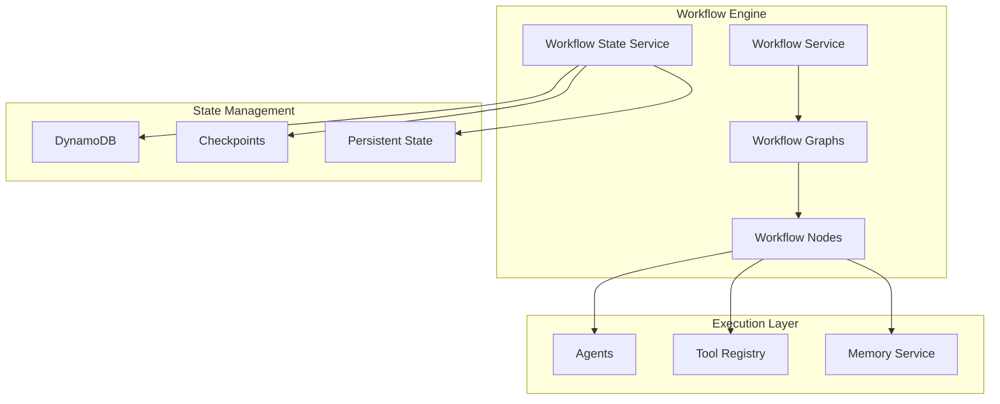

# Workflow Development Guide

## Table of Contents
- [Overview](#overview)
- [Workflow Architecture](#workflow-architecture)
- [Creating Workflows](#creating-workflows)
- [Workflow States](#workflow-states)
- [Workflow Nodes](#workflow-nodes)
- [State Management](#state-management)
- [Error Handling](#error-handling)
- [Testing Workflows](#testing-workflows)
- [Performance Optimization](#performance-optimization)
- [Best Practices](#best-practices)

## Overview

This guide covers the development of AI workflows using LangGraph within the Bedrock Agent System. Workflows provide a structured way to orchestrate complex multi-step AI operations with state management, error recovery, and parallel execution capabilities.

### Key Features

- **State-based Execution**: Persistent state management with checkpointing
- **Error Recovery**: Automatic error handling and workflow resumption
- **Parallel Processing**: Efficient parallel execution of independent steps
- **Dynamic Routing**: Conditional workflow paths based on state
- **Memory Integration**: Context-aware execution with memory system
- **Tool Integration**: Seamless integration with MCP tools and agents

## Workflow Architecture

### Core Components



### Workflow Lifecycle

1. **Initialization**: Create initial workflow state
2. **Execution**: Execute workflow nodes based on state
3. **State Updates**: Update state after each node execution
4. **Checkpointing**: Save state to persistent storage
5. **Routing**: Determine next steps based on current state
6. **Completion**: Finalize workflow and cleanup resources

## Creating Workflows

### Basic Workflow Structure

```typescript
// Define workflow state interface
export interface CustomWorkflowState extends BaseWorkflowState {
  workflowId: string;
  stage: 'start' | 'processing' | 'analysis' | 'completed' | 'error';
  inputData: any;
  processingResult?: any;
  analysisResult?: any;
  finalResult?: any;
  error?: string;
  options: {
    enableCaching: boolean;
    analysisDepth: 'basic' | 'detailed' | 'comprehensive';
  };
}

// Create workflow nodes
@Injectable()
export class CustomWorkflowNodes {
  constructor(
    private readonly agentService: AgentService,
    private readonly toolRegistry: MCPToolRegistry,
  ) {}

  async processData(state: CustomWorkflowState): Promise<CustomWorkflowState> {
    // Node implementation
    const result = await this.performProcessing(state.inputData);
    
    return {
      ...state,
      stage: 'analysis',
      processingResult: result,
      lastUpdated: Date.now(),
    };
  }

  async analyzeData(state: CustomWorkflowState): Promise<CustomWorkflowState> {
    // Node implementation
    const analysis = await this.performAnalysis(state.processingResult);
    
    return {
      ...state,
      stage: 'completed',
      analysisResult: analysis,
      finalResult: analysis,
      lastUpdated: Date.now(),
    };
  }
}

// Define workflow graph
@Injectable()
export class CustomWorkflow {
  private workflow: any;

  constructor(
    private readonly nodes: CustomWorkflowNodes,
    private readonly stateService: WorkflowStateService,
  ) {
    this.initializeWorkflow();
  }

  private initializeWorkflow() {
    // Router function for conditional edges
    const router = (state: CustomWorkflowState): string => {
      if (state.error) return END;
      
      switch (state.stage) {
        case 'start': return 'process_data';
        case 'processing': return 'analyze_data';
        case 'analysis': return END;
        default: return END;
      }
    };

    // Create workflow graph
    this.workflow = new StateGraph<CustomWorkflowState>({
      channels: {
        workflowId: { default: () => '' },
        stage: { default: () => 'start' },
        inputData: { default: () => null },
        processingResult: { default: () => null },
        analysisResult: { default: () => null },
        finalResult: { default: () => null },
        error: { default: () => null },
        options: { default: () => ({ enableCaching: true, analysisDepth: 'basic' }) },
        startTime: { default: () => Date.now() },
        lastUpdated: { default: () => Date.now() },
      }
    });

    // Add nodes
    this.workflow.addNode('process_data', this.nodes.processData.bind(this.nodes));
    this.workflow.addNode('analyze_data', this.nodes.analyzeData.bind(this.nodes));

    // Set entry point
    this.workflow.setEntryPoint('process_data');

    // Add conditional edges
    this.workflow.addConditionalEdges('process_data', router);
    this.workflow.addConditionalEdges('analyze_data', router);

    // Compile workflow
    this.workflow = this.workflow.compile();
  }

  async execute(inputData: any, options?: any): Promise<CustomWorkflowState> {
    const workflowId = `custom_${Date.now()}_${Math.random().toString(36).substr(2, 9)}`;
    
    const initialState: CustomWorkflowState = {
      workflowId,
      stage: 'start',
      inputData,
      options: { enableCaching: true, analysisDepth: 'basic', ...options },
      startTime: Date.now(),
      lastUpdated: Date.now(),
    };

    // Save initial state
    await this.stateService.saveWorkflowState(workflowId, initialState);
    
    // Execute workflow
    const result = await this.workflow.invoke(initialState);
    
    // Save final state
    await this.stateService.saveWorkflowState(workflowId, result);
    
    return result;
  }
}
```

### Advanced Workflow Features

#### Parallel Execution

```typescript
// Workflow with parallel branches
export class ParallelWorkflow {
  private initializeWorkflow() {
    const workflow = new StateGraph<ParallelWorkflowState>({
      // State definition
    });

    // Add parallel nodes
    workflow.addNode('branch_a', this.nodes.processBranchA.bind(this.nodes));
    workflow.addNode('branch_b', this.nodes.processBranchB.bind(this.nodes));
    workflow.addNode('branch_c', this.nodes.processBranchC.bind(this.nodes));
    workflow.addNode('merge_results', this.nodes.mergeResults.bind(this.nodes));

    // Set up parallel execution
    workflow.setEntryPoint('branch_a');
    workflow.addEdge('branch_a', 'merge_results');
    workflow.addEdge('branch_b', 'merge_results');
    workflow.addEdge('branch_c', 'merge_results');

    // Start parallel branches
    workflow.addConditionalEdges('__start__', (state) => {
      // Start all branches in parallel
      return ['branch_a', 'branch_b', 'branch_c'];
    });

    this.workflow = workflow.compile();
  }
}
```

#### Conditional Routing

```typescript
// Complex conditional routing
const complexRouter = (state: WorkflowState): string => {
  // Error handling
  if (state.error) {
    return state.retryCount < 3 ? 'retry_step' : 'error_handler';
  }

  // Business logic routing
  switch (state.stage) {
    case 'validation':
      return state.validationPassed ? 'processing' : 'validation_error';
    
    case 'processing':
      if (state.processingResult?.confidence > 0.8) {
        return 'high_confidence_path';
      } else if (state.processingResult?.confidence > 0.5) {
        return 'medium_confidence_path';
      } else {
        return 'low_confidence_path';
      }
    
    case 'analysis':
      return state.options.generateReport ? 'report_generation' : 'finalization';
    
    default:
      return END;
  }
};
```

#### Dynamic Node Creation

```typescript
// Dynamic workflow generation
export class DynamicWorkflow {
  createWorkflowFromConfig(config: WorkflowConfig): StateGraph<any> {
    const workflow = new StateGraph<any>({
      channels: this.buildChannelsFromConfig(config),
    });

    // Add nodes dynamically
    config.steps.forEach(step => {
      const nodeFunction = this.createNodeFunction(step);
      workflow.addNode(step.name, nodeFunction);
    });

    // Add edges based on configuration
    config.edges.forEach(edge => {
      if (edge.conditional) {
        const routerFunction = this.createRouterFunction(edge.conditions);
        workflow.addConditionalEdges(edge.from, routerFunction);
      } else {
        workflow.addEdge(edge.from, edge.to);
      }
    });

    workflow.setEntryPoint(config.entryPoint);
    return workflow.compile();
  }

  private createNodeFunction(stepConfig: StepConfig): (state: any) => Promise<any> {
    return async (state: any) => {
      switch (stepConfig.type) {
        case 'agent':
          return this.executeAgent(stepConfig, state);
        case 'tool':
          return this.executeTool(stepConfig, state);
        case 'custom':
          return this.executeCustomFunction(stepConfig, state);
        default:
          throw new Error(`Unknown step type: ${stepConfig.type}`);
      }
    };
  }
}
```

## Workflow States

### State Design Principles

1. **Immutability**: Always return new state objects
2. **Serialization**: Ensure state can be serialized to JSON
3. **Versioning**: Include version information for schema evolution
4. **Metadata**: Include timing and execution metadata

### State Interface Design

```typescript
// Base workflow state
export interface BaseWorkflowState {
  workflowId: string;
  version: string;
  startTime: number;
  lastUpdated: number;
  retryCount: number;
  metadata: {
    executionId: string;
    userId?: string;
    correlationId?: string;
    tags: string[];
  };
}

// Extended state for specific workflows
export interface CodeAnalysisWorkflowState extends BaseWorkflowState {
  // Workflow-specific fields
  analysisStage: 'start' | 'parsing' | 'analysis' | 'documentation' | 'completed';
  filePath: string;
  
  // Results from each stage
  parsingResult?: {
    ast: any;
    dependencies: string[];
    metrics: CodeMetrics;
  };
  
  analysisResult?: {
    issues: Issue[];
    patterns: Pattern[];
    suggestions: Suggestion[];
  };
  
  documentationResult?: {
    apiDocs: string;
    readme: string;
    comments: string[];
  };
  
  // Configuration
  options: {
    includeTests: boolean;
    generateDocs: boolean;
    analysisDepth: 'quick' | 'standard' | 'deep';
  };
  
  // Error handling
  error?: {
    message: string;
    stage: string;
    timestamp: number;
    recoverable: boolean;
  };
}
```

### State Validation

```typescript
// State validation service
@Injectable()
export class StateValidationService {
  validateState<T extends BaseWorkflowState>(
    state: T,
    schema: StateSchema
  ): ValidationResult {
    const errors: string[] = [];
    
    // Validate required fields
    if (!state.workflowId) errors.push('workflowId is required');
    if (!state.version) errors.push('version is required');
    if (!state.startTime) errors.push('startTime is required');
    
    // Validate field types
    if (typeof state.workflowId !== 'string') {
      errors.push('workflowId must be a string');
    }
    
    // Validate against schema
    const schemaErrors = this.validateAgainstSchema(state, schema);
    errors.push(...schemaErrors);
    
    return {
      valid: errors.length === 0,
      errors,
    };
  }

  private validateAgainstSchema(state: any, schema: StateSchema): string[] {
    const errors: string[] = [];
    
    // Implement JSON schema validation
    // This is a simplified example
    Object.entries(schema.properties).forEach(([key, propSchema]) => {
      const value = state[key];
      
      if (propSchema.required && value === undefined) {
        errors.push(`${key} is required`);
      }
      
      if (value !== undefined && typeof value !== propSchema.type) {
        errors.push(`${key} must be of type ${propSchema.type}`);
      }
    });
    
    return errors;
  }
}
```

## Workflow Nodes

### Node Implementation Patterns

#### Agent Integration Node

```typescript
export class AgentNode {
  constructor(
    private readonly agentService: AgentService,
    private readonly memoryService: MemoryService,
  ) {}

  async executeAgent(
    agentType: string,
    prompt: string,
    state: any
  ): Promise<any> {
    // Prepare context from state and memory
    const context = await this.prepareContext(state);
    
    // Execute agent
    const result = await this.agentService.execute(agentType, prompt, {
      context,
      temperature: state.options?.temperature || 0.2,
      maxTokens: state.options?.maxTokens || 4096,
    });
    
    // Store result in memory if configured
    if (state.options?.storeInMemory) {
      await this.memoryService.store({
        content: JSON.stringify(result),
        metadata: {
          workflowId: state.workflowId,
          agentType,
          stage: state.stage || 'unknown',
        },
      });
    }
    
    return {
      ...state,
      [`${agentType}Result`]: result,
      lastUpdated: Date.now(),
    };
  }

  private async prepareContext(state: any): Promise<any> {
    // Extract relevant context from state
    const context = {
      workflowId: state.workflowId,
      stage: state.stage,
      previousResults: this.extractPreviousResults(state),
    };
    
    // Add memory context if available
    if (state.options?.useMemory) {
      const memoryContext = await this.memoryService.search({
        query: this.buildMemoryQuery(state),
        limit: 5,
        threshold: 0.7,
      });
      
      context.memory = memoryContext.map(item => item.content);
    }
    
    return context;
  }
}
```

#### Tool Integration Node

```typescript
export class ToolNode {
  constructor(
    private readonly toolRegistry: MCPToolRegistry,
  ) {}

  async executeTool(
    toolName: string,
    parameters: any,
    state: any
  ): Promise<any> {
    try {
      // Add workflow context to tool execution
      const toolContext = {
        workflowId: state.workflowId,
        stage: state.stage,
        metadata: state.metadata,
      };
      
      // Execute tool
      const result = await this.toolRegistry.executeTool(
        toolName,
        parameters,
        toolContext
      );
      
      return {
        ...state,
        [`${toolName}Result`]: result,
        lastUpdated: Date.now(),
      };
    } catch (error: any) {
      return {
        ...state,
        error: {
          message: error.message,
          stage: state.stage,
          tool: toolName,
          timestamp: Date.now(),
          recoverable: this.isRecoverableError(error),
        },
        lastUpdated: Date.now(),
      };
    }
  }

  private isRecoverableError(error: Error): boolean {
    // Determine if error is recoverable
    const recoverableErrors = [
      'TimeoutError',
      'NetworkError',
      'TemporaryServiceUnavailable',
    ];
    
    return recoverableErrors.some(type => 
      error.constructor.name === type || error.message.includes(type)
    );
  }
}
```

#### Data Processing Node

```typescript
export class DataProcessingNode {
  async processLargeDataset(
    data: any[],
    processingFunction: (item: any) => Promise<any>,
    state: any
  ): Promise<any> {
    const batchSize = state.options?.batchSize || 10;
    const results = [];
    
    // Process in batches to avoid memory issues
    for (let i = 0; i < data.length; i += batchSize) {
      const batch = data.slice(i, i + batchSize);
      
      // Process batch in parallel
      const batchResults = await Promise.all(
        batch.map(item => this.processWithErrorHandling(item, processingFunction))
      );
      
      results.push(...batchResults);
      
      // Update progress
      const progress = Math.round(((i + batch.length) / data.length) * 100);
      
      // Save checkpoint if configured
      if (state.options?.enableCheckpoints && progress % 25 === 0) {
        await this.saveCheckpoint(state, {
          progress,
          processedItems: i + batch.length,
          partialResults: results,
        });
      }
    }
    
    return {
      ...state,
      processingResult: results,
      progress: 100,
      lastUpdated: Date.now(),
    };
  }

  private async processWithErrorHandling(
    item: any,
    processingFunction: (item: any) => Promise<any>
  ): Promise<any> {
    try {
      return await processingFunction(item);
    } catch (error: any) {
      // Log error but continue processing
      console.warn('Error processing item:', error);
      return { error: error.message, item };
    }
  }
}
```

## State Management

### Persistent State Storage

```typescript
@Injectable()
export class WorkflowStateService {
  constructor(
    private readonly dynamodb: DynamoDB,
    private readonly configService: ConfigService,
  ) {}

  async saveWorkflowState<T extends BaseWorkflowState>(
    workflowId: string,
    state: T
  ): Promise<void> {
    const item = {
      workflowId: { S: workflowId },
      state: { S: JSON.stringify(state) },
      lastUpdated: { N: Date.now().toString() },
      ttl: { N: Math.floor((Date.now() + 86400000) / 1000).toString() }, // 24 hours TTL
      stage: { S: state.stage || 'unknown' },
      version: { S: state.version || '1.0' },
    };

    await this.dynamodb.putItem({
      TableName: this.configService.get('DYNAMODB_WORKFLOW_STATE_TABLE'),
      Item: item,
    }).promise();
  }

  async getWorkflowState<T extends BaseWorkflowState>(
    workflowId: string
  ): Promise<T | null> {
    const result = await this.dynamodb.getItem({
      TableName: this.configService.get('DYNAMODB_WORKFLOW_STATE_TABLE'),
      Key: {
        workflowId: { S: workflowId },
      },
    }).promise();

    if (!result.Item) {
      return null;
    }

    return JSON.parse(result.Item.state.S!);
  }

  async saveCheckpoint<T extends BaseWorkflowState>(
    workflowId: string,
    stage: string,
    state: T
  ): Promise<void> {
    const checkpointId = `${workflowId}_${stage}_${Date.now()}`;
    
    const item = {
      checkpointId: { S: checkpointId },
      workflowId: { S: workflowId },
      stage: { S: stage },
      state: { S: JSON.stringify(state) },
      timestamp: { N: Date.now().toString() },
      ttl: { N: Math.floor((Date.now() + 604800000) / 1000).toString() }, // 7 days TTL
    };

    await this.dynamodb.putItem({
      TableName: `${this.configService.get('DYNAMODB_WORKFLOW_STATE_TABLE')}_Checkpoints`,
      Item: item,
    }).promise();
  }

  async getLatestCheckpoint<T extends BaseWorkflowState>(
    workflowId: string
  ): Promise<{ stage: string; state: T } | null> {
    const result = await this.dynamodb.query({
      TableName: `${this.configService.get('DYNAMODB_WORKFLOW_STATE_TABLE')}_Checkpoints`,
      IndexName: 'WorkflowIdIndex',
      KeyConditionExpression: 'workflowId = :workflowId',
      ExpressionAttributeValues: {
        ':workflowId': { S: workflowId },
      },
      ScanIndexForward: false, // Latest first
      Limit: 1,
    }).promise();

    if (!result.Items || result.Items.length === 0) {
      return null;
    }

    const item = result.Items[0];
    return {
      stage: item.stage.S!,
      state: JSON.parse(item.state.S!),
    };
  }
}
```

### State Migrations

```typescript
@Injectable()
export class StateMigrationService {
  private migrations: Map<string, StateMigration[]> = new Map();

  registerMigration(
    fromVersion: string,
    toVersion: string,
    migration: StateMigration
  ): void {
    const key = `${fromVersion}->${toVersion}`;
    if (!this.migrations.has(key)) {
      this.migrations.set(key, []);
    }
    this.migrations.get(key)!.push(migration);
  }

  async migrateState<T extends BaseWorkflowState>(
    state: any,
    targetVersion: string
  ): Promise<T> {
    const currentVersion = state.version || '1.0';
    
    if (currentVersion === targetVersion) {
      return state;
    }

    // Find migration path
    const migrationPath = this.findMigrationPath(currentVersion, targetVersion);
    
    if (!migrationPath) {
      throw new Error(`No migration path from ${currentVersion} to ${targetVersion}`);
    }

    // Apply migrations in sequence
    let migratedState = state;
    for (const step of migrationPath) {
      const migrations = this.migrations.get(step);
      if (migrations) {
        for (const migration of migrations) {
          migratedState = await migration.migrate(migratedState);
        }
      }
    }

    return migratedState;
  }

  private findMigrationPath(
    fromVersion: string,
    toVersion: string
  ): string[] | null {
    // Implement graph traversal to find migration path
    // This is a simplified example
    const knownVersions = ['1.0', '1.1', '2.0'];
    const fromIndex = knownVersions.indexOf(fromVersion);
    const toIndex = knownVersions.indexOf(toVersion);
    
    if (fromIndex === -1 || toIndex === -1) {
      return null;
    }

    const path = [];
    for (let i = fromIndex; i < toIndex; i++) {
      path.push(`${knownVersions[i]}->${knownVersions[i + 1]}`);
    }
    
    return path;
  }
}

// Example migration
export class StateV1ToV2Migration implements StateMigration {
  async migrate(state: any): Promise<any> {
    return {
      ...state,
      version: '2.0',
      metadata: {
        ...state.metadata,
        migratedAt: Date.now(),
        migratedFrom: '1.0',
      },
      // Add new fields with defaults
      options: {
        ...state.options,
        enableAdvancedFeatures: false,
      },
    };
  }
}
```

## Error Handling

### Error Recovery Strategies

```typescript
@Injectable()
export class WorkflowErrorHandler {
  async handleError<T extends BaseWorkflowState>(
    error: Error,
    state: T,
    context: ExecutionContext
  ): Promise<T> {
    const errorInfo = {
      message: error.message,
      stack: error.stack,
      stage: state.stage || 'unknown',
      timestamp: Date.now(),
      recoverable: this.isRecoverableError(error),
      retryCount: state.retryCount || 0,
    };

    // Log error
    console.error('Workflow error occurred:', errorInfo);

    // Determine recovery strategy
    if (errorInfo.recoverable && errorInfo.retryCount < 3) {
      return this.retryWithBackoff(state, errorInfo);
    } else if (this.canSkipStep(error, state)) {
      return this.skipStep(state, errorInfo);
    } else if (this.canRevertToCheckpoint(state)) {
      return this.revertToCheckpoint(state, errorInfo);
    } else {
      return this.markAsFailed(state, errorInfo);
    }
  }

  private async retryWithBackoff<T extends BaseWorkflowState>(
    state: T,
    errorInfo: any
  ): Promise<T> {
    const backoffDelay = Math.min(1000 * Math.pow(2, errorInfo.retryCount), 30000);
    
    await new Promise(resolve => setTimeout(resolve, backoffDelay));
    
    return {
      ...state,
      retryCount: errorInfo.retryCount + 1,
      lastError: errorInfo,
      lastUpdated: Date.now(),
    };
  }

  private skipStep<T extends BaseWorkflowState>(
    state: T,
    errorInfo: any
  ): Promise<T> {
    return Promise.resolve({
      ...state,
      skippedSteps: [...(state.skippedSteps || []), state.stage],
      lastError: errorInfo,
      lastUpdated: Date.now(),
    });
  }

  private async revertToCheckpoint<T extends BaseWorkflowState>(
    state: T,
    errorInfo: any
  ): Promise<T> {
    const checkpoint = await this.stateService.getLatestCheckpoint(state.workflowId);
    
    if (!checkpoint) {
      throw new Error('No checkpoint available for recovery');
    }

    return {
      ...checkpoint.state,
      recoveredFrom: {
        stage: state.stage,
        error: errorInfo,
        timestamp: Date.now(),
      },
      lastUpdated: Date.now(),
    };
  }

  private isRecoverableError(error: Error): boolean {
    const recoverableTypes = [
      'TimeoutError',
      'NetworkError',
      'TemporaryServiceUnavailable',
      'RateLimitError',
    ];

    return recoverableTypes.some(type => 
      error.constructor.name === type || 
      error.message.includes(type)
    );
  }
}
```

### Circuit Breaker Pattern

```typescript
@Injectable()
export class WorkflowCircuitBreaker {
  private circuitStates = new Map<string, CircuitState>();

  async executeWithCircuitBreaker<T>(
    operation: () => Promise<T>,
    operationKey: string
  ): Promise<T> {
    const circuit = this.getCircuitState(operationKey);
    
    if (circuit.state === 'OPEN') {
      if (Date.now() - circuit.lastFailureTime < circuit.timeout) {
        throw new Error(`Circuit breaker is OPEN for ${operationKey}`);
      } else {
        // Try to close circuit
        circuit.state = 'HALF_OPEN';
      }
    }

    try {
      const result = await operation();
      
      // Success - reset circuit
      circuit.failureCount = 0;
      circuit.state = 'CLOSED';
      
      return result;
    } catch (error: any) {
      circuit.failureCount++;
      circuit.lastFailureTime = Date.now();
      
      if (circuit.failureCount >= circuit.failureThreshold) {
        circuit.state = 'OPEN';
      }
      
      throw error;
    }
  }

  private getCircuitState(operationKey: string): CircuitState {
    if (!this.circuitStates.has(operationKey)) {
      this.circuitStates.set(operationKey, {
        state: 'CLOSED',
        failureCount: 0,
        failureThreshold: 5,
        timeout: 60000, // 1 minute
        lastFailureTime: 0,
      });
    }
    
    return this.circuitStates.get(operationKey)!;
  }
}
```

## Testing Workflows

### Unit Testing Workflow Nodes

```typescript
describe('CustomWorkflowNodes', () => {
  let nodes: CustomWorkflowNodes;
  let mockAgentService: jest.Mocked<AgentService>;
  let mockToolRegistry: jest.Mocked<MCPToolRegistry>;

  beforeEach(() => {
    const module = Test.createTestingModule({
      providers: [
        CustomWorkflowNodes,
        { provide: AgentService, useValue: mockAgentService },
        { provide: MCPToolRegistry, useValue: mockToolRegistry },
      ],
    }).compile();

    nodes = module.get<CustomWorkflowNodes>(CustomWorkflowNodes);
  });

  describe('processData', () => {
    it('should process data and update state', async () => {
      // Arrange
      const inputState: CustomWorkflowState = {
        workflowId: 'test-workflow',
        stage: 'start',
        inputData: { content: 'test data' },
        options: { enableCaching: true, analysisDepth: 'basic' },
        startTime: Date.now(),
        lastUpdated: Date.now(),
      };

      // Act
      const result = await nodes.processData(inputState);

      // Assert
      expect(result.stage).toBe('analysis');
      expect(result.processingResult).toBeDefined();
      expect(result.lastUpdated).toBeGreaterThan(inputState.lastUpdated);
    });

    it('should handle processing errors gracefully', async () => {
      // Arrange
      const inputState: CustomWorkflowState = {
        workflowId: 'test-workflow',
        stage: 'start',
        inputData: null, // Invalid data
        options: { enableCaching: true, analysisDepth: 'basic' },
        startTime: Date.now(),
        lastUpdated: Date.now(),
      };

      // Act & Assert
      await expect(nodes.processData(inputState)).rejects.toThrow('Invalid input data');
    });
  });
});
```

### Integration Testing Complete Workflows

```typescript
describe('CustomWorkflow Integration', () => {
  let app: INestApplication;
  let workflow: CustomWorkflow;
  let stateService: WorkflowStateService;

  beforeAll(async () => {
    const module = await Test.createTestingModule({
      imports: [WorkflowModule],
    }).compile();

    app = module.createNestApplication();
    await app.init();

    workflow = module.get<CustomWorkflow>(CustomWorkflow);
    stateService = module.get<WorkflowStateService>(WorkflowStateService);
  });

  afterAll(async () => {
    await app.close();
  });

  it('should execute complete workflow successfully', async () => {
    // Arrange
    const inputData = { content: 'test analysis data' };
    const options = { analysisDepth: 'detailed' };

    // Act
    const result = await workflow.execute(inputData, options);

    // Assert
    expect(result.stage).toBe('completed');
    expect(result.finalResult).toBeDefined();
    expect(result.error).toBeUndefined();

    // Verify state was persisted
    const savedState = await stateService.getWorkflowState(result.workflowId);
    expect(savedState).toBeDefined();
    expect(savedState!.stage).toBe('completed');
  });

  it('should handle workflow errors and recovery', async () => {
    // Arrange
    const inputData = { content: 'invalid data that causes error' };

    // Act & Assert
    await expect(workflow.execute(inputData)).rejects.toThrow();

    // Verify error state was saved
    // Implementation depends on specific error handling
  });
});
```

### End-to-End Workflow Testing

```typescript
describe('Workflow E2E Tests', () => {
  let app: INestApplication;

  beforeAll(async () => {
    const module = await Test.createTestingModule({
      imports: [AppModule],
    }).compile();

    app = module.createNestApplication();
    await app.init();
  });

  afterAll(async () => {
    await app.close();
  });

  it('should execute workflow via API', async () => {
    const workflowData = {
      type: 'custom_analysis',
      parameters: {
        inputData: { content: 'test data' },
        options: { analysisDepth: 'detailed' },
      },
    };

    const response = await request(app.getHttpServer())
      .post('/api/v1/workflows')
      .send(workflowData)
      .expect(201);

    expect(response.body.data.workflowId).toBeDefined();
    expect(response.body.data.status).toBe('running');

    // Poll for completion
    const workflowId = response.body.data.workflowId;
    let completed = false;
    let attempts = 0;

    while (!completed && attempts < 30) {
      const statusResponse = await request(app.getHttpServer())
        .get(`/api/v1/workflows/${workflowId}`)
        .expect(200);

      if (statusResponse.body.data.status === 'completed') {
        completed = true;
        expect(statusResponse.body.data.result).toBeDefined();
      } else {
        await new Promise(resolve => setTimeout(resolve, 1000));
        attempts++;
      }
    }

    expect(completed).toBe(true);
  });
});
```

## Performance Optimization

### Parallel Node Execution

```typescript
// Optimize workflow for parallel execution
export class OptimizedWorkflow {
  private async executeBatchSteps(
    steps: WorkflowStep[],
    state: WorkflowState
  ): Promise<WorkflowState> {
    // Group steps that can run in parallel
    const parallelGroups = this.groupParallelSteps(steps);
    
    let currentState = state;
    
    for (const group of parallelGroups) {
      if (group.length === 1) {
        // Single step execution
        currentState = await this.executeStep(group[0], currentState);
      } else {
        // Parallel execution
        const results = await Promise.all(
          group.map(step => this.executeStepWithContext(step, currentState))
        );
        
        // Merge results
        currentState = this.mergeStepResults(currentState, results);
      }
    }
    
    return currentState;
  }

  private groupParallelSteps(steps: WorkflowStep[]): WorkflowStep[][] {
    const groups: WorkflowStep[][] = [];
    const processed = new Set<string>();
    
    for (const step of steps) {
      if (processed.has(step.id)) continue;
      
      const parallelSteps = [step];
      processed.add(step.id);
      
      // Find steps that can run in parallel with this one
      for (const otherStep of steps) {
        if (processed.has(otherStep.id)) continue;
        
        if (this.canRunInParallel(step, otherStep, steps)) {
          parallelSteps.push(otherStep);
          processed.add(otherStep.id);
        }
      }
      
      groups.push(parallelSteps);
    }
    
    return groups;
  }

  private canRunInParallel(
    step1: WorkflowStep,
    step2: WorkflowStep,
    allSteps: WorkflowStep[]
  ): boolean {
    // Check if steps have conflicting dependencies
    const step1Deps = new Set(step1.dependencies || []);
    const step2Deps = new Set(step2.dependencies || []);
    
    // Steps can't run in parallel if one depends on the other
    if (step1Deps.has(step2.id) || step2Deps.has(step1.id)) {
      return false;
    }
    
    // Check for resource conflicts
    if (this.hasResourceConflicts(step1, step2)) {
      return false;
    }
    
    return true;
  }
}
```

### Memory-Efficient State Management

```typescript
// Optimize state serialization and storage
export class OptimizedStateService {
  async saveWorkflowStateOptimized<T extends BaseWorkflowState>(
    workflowId: string,
    state: T
  ): Promise<void> {
    // Compress large state objects
    const stateString = JSON.stringify(state);
    
    let finalState: string;
    if (stateString.length > 10240) { // 10KB threshold
      finalState = await this.compressState(stateString);
    } else {
      finalState = stateString;
    }
    
    // Use batch operations for better performance
    const item = {
      workflowId: { S: workflowId },
      state: { S: finalState },
      compressed: { BOOL: stateString.length > 10240 },
      lastUpdated: { N: Date.now().toString() },
      ttl: { N: Math.floor((Date.now() + 86400000) / 1000).toString() },
    };

    await this.dynamodb.putItem({
      TableName: this.configService.get('DYNAMODB_WORKFLOW_STATE_TABLE'),
      Item: item,
      ConditionExpression: 'attribute_not_exists(workflowId) OR lastUpdated < :newTimestamp',
      ExpressionAttributeValues: {
        ':newTimestamp': { N: Date.now().toString() },
      },
    }).promise();
  }

  async getWorkflowStateOptimized<T extends BaseWorkflowState>(
    workflowId: string
  ): Promise<T | null> {
    const result = await this.dynamodb.getItem({
      TableName: this.configService.get('DYNAMODB_WORKFLOW_STATE_TABLE'),
      Key: { workflowId: { S: workflowId } },
      ProjectionExpression: '#state, compressed',
      ExpressionAttributeNames: { '#state': 'state' },
    }).promise();

    if (!result.Item) return null;

    let stateString = result.Item.state.S!;
    const isCompressed = result.Item.compressed?.BOOL || false;

    if (isCompressed) {
      stateString = await this.decompressState(stateString);
    }

    return JSON.parse(stateString);
  }

  private async compressState(stateString: string): Promise<string> {
    return new Promise((resolve, reject) => {
      zlib.gzip(stateString, (err, compressed) => {
        if (err) reject(err);
        else resolve(compressed.toString('base64'));
      });
    });
  }

  private async decompressState(compressedString: string): Promise<string> {
    return new Promise((resolve, reject) => {
      const buffer = Buffer.from(compressedString, 'base64');
      zlib.gunzip(buffer, (err, decompressed) => {
        if (err) reject(err);
        else resolve(decompressed.toString());
      });
    });
  }
}
```

## Best Practices

### Workflow Design Guidelines

1. **Keep States Immutable**: Always return new state objects rather than modifying existing ones
2. **Design for Failure**: Implement comprehensive error handling and recovery mechanisms
3. **Minimize State Size**: Store only essential data in workflow state; use external storage for large objects
4. **Use Checkpoints**: Implement checkpointing for long-running workflows
5. **Enable Parallel Execution**: Design workflows to take advantage of parallel processing where possible
6. **Version States**: Include version information for state schema evolution
7. **Monitor Performance**: Track workflow execution metrics and optimize bottlenecks

### Node Implementation Guidelines

1. **Single Responsibility**: Each node should have a single, well-defined responsibility
2. **Idempotent Operations**: Design nodes to be safely retryable
3. **Resource Management**: Properly manage resources and connections within nodes
4. **Error Propagation**: Provide clear error messages and context for debugging
5. **Timeout Handling**: Implement appropriate timeouts for external service calls
6. **Memory Efficiency**: Process large datasets in streams or batches

### State Management Guidelines

1. **Schema Evolution**: Plan for state schema changes and migrations
2. **Serialization Safety**: Ensure all state data can be safely serialized to JSON
3. **Size Limits**: Keep state objects under reasonable size limits (< 400KB)
4. **TTL Management**: Set appropriate TTL values for state cleanup
5. **Consistency**: Maintain consistency between in-memory and persisted state

### Testing Guidelines

1. **Unit Test Nodes**: Test individual nodes in isolation
2. **Integration Test Workflows**: Test complete workflow execution paths
3. **Test Error Scenarios**: Verify error handling and recovery mechanisms
4. **Performance Testing**: Test workflow performance under load
5. **State Validation**: Test state transitions and validation logic

This workflow development guide provides comprehensive guidance for building robust, scalable, and maintainable AI workflows within the Bedrock Agent System. Following these patterns and practices will ensure reliable workflow execution and easy system maintenance.